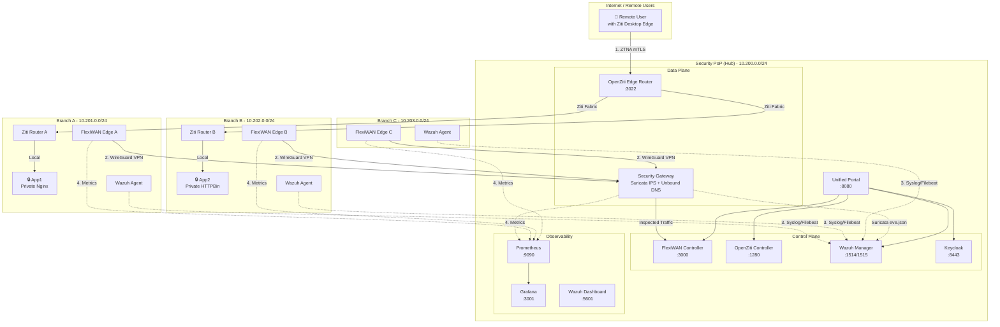
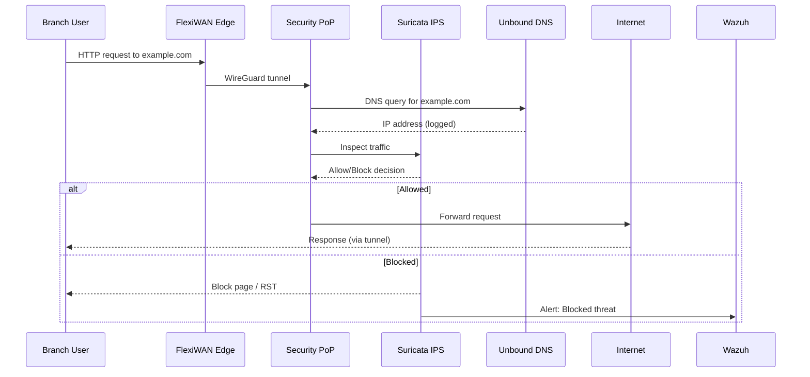
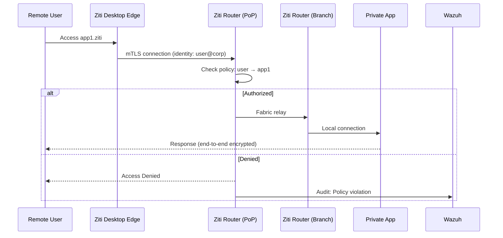
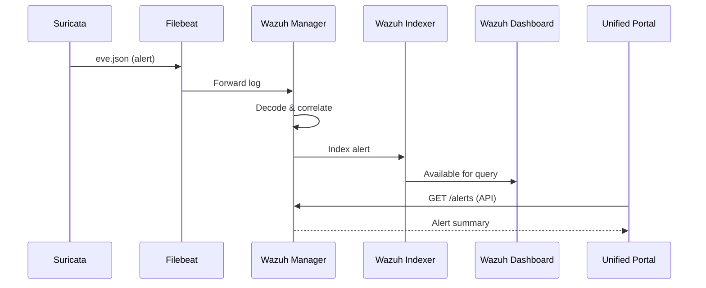

# OpenSASE-Lab Architecture

This document describes the architecture of OpenSASE-Lab, a fully reproducible SASE (Secure Access Service Edge) security lab.

## High-Level Architecture



## Component Overview

### 1. SD-WAN Layer (FlexiWAN)

| Component | Image | Purpose |
|-----------|-------|---------|
| flexiwan-controller | `flexiwan/flexiwan` | Central management, policy distribution |
| flexiwan-mongo | `mongo:6` | Controller database |
| branch-a/b/c | `flexiwan/flexiwan-router` | Edge routers with WireGuard tunnels |

**Key Features:**
- WireGuard-based VPN tunnels (fast, modern cryptography)
- Application-aware routing
- Link quality monitoring (latency, jitter, packet loss)
- Automatic failover between WAN links

### 2. Security PoP Gateway

| Component | Technology | Purpose |
|-----------|------------|---------|
| security-pop | Alpine Linux | Base OS for gateway |
| Suricata | IPS Mode | Inline threat detection and prevention |
| Unbound | DNS Resolver | DNS filtering with query logging |
| nftables | Firewall | Zone-based policy enforcement |

**Traffic Flow:**
```
Branch → WireGuard Tunnel → Security PoP → Suricata IPS → Internet
                                    ↓
                            Unbound DNS (if DNS query)
```

### 3. Zero Trust Network Access (OpenZiti)

| Component | Purpose |
|-----------|---------|
| ziti-controller | PKI, identity management, policy engine |
| ziti-router-pop | PoP-side edge router (public listener) |
| ziti-router-a/b | Branch-side edge routers (hosts services) |

**Zero Trust Principles:**
- Apps have no public IP or ports (dark services)
- Access requires enrolled identity + policy match
- All traffic is mTLS encrypted end-to-end
- Session-level authorization with posture checks

### 4. Security Visibility (Wazuh)

| Component | Purpose |
|-----------|---------|
| wazuh-manager | Log collection, analysis, alerting |
| wazuh-indexer | OpenSearch-based log storage |
| wazuh-dashboard | Security analytics UI |

**Log Sources:**
- Suricata IDS/IPS alerts (eve.json)
- FlexiWAN system logs
- OpenZiti audit logs
- OS-level events from all nodes

### 5. Identity (Keycloak)

| Component | Purpose |
|-----------|---------|
| keycloak | OIDC/SAML identity provider |
| keycloak-db | PostgreSQL for Keycloak |

**Realm: opensase-lab**
- Client: `portal-app` (Unified Portal)
- Client: `grafana` (Grafana SSO)
- Roles: `admin`, `operator`, `viewer`

### 6. Observability (Prometheus + Grafana)

| Exporter | Metrics |
|----------|---------|
| node_exporter | CPU, memory, disk, network |
| suricata_exporter | IPS stats, flow counts |
| flexiwan_exporter | Tunnel status, link quality |
| ziti_exporter | Session counts, policy hits |

**Dashboards:**
- SD-WAN Overview (tunnel health, bandwidth)
- Security PoP (IPS alerts, DNS queries)
- ZTNA Sessions (active sessions, policy decisions)
- System Health (resource utilization)

### 7. Unified Portal

| Component | Technology | Purpose |
|-----------|------------|---------|
| portal-backend | FastAPI + Python | API aggregation, SSO |
| portal-frontend | React + Vite | Dashboard UI |

**Aggregated Views:**
- Sites & Tunnels (FlexiWAN API)
- Security Policies (Suricata stats API)
- ZTNA Apps (Ziti Management API)
- Security Alerts (Wazuh API)

---

## Network Architecture

### Docker Networks

| Network | Subnet | Purpose |
|---------|--------|---------|
| pop-net | 10.200.0.0/24 | Security PoP components |
| branch-a-net | 10.201.0.0/24 | Branch A isolated network |
| branch-b-net | 10.202.0.0/24 | Branch B isolated network |
| branch-c-net | 10.203.0.0/24 | Branch C isolated network |
| ziti-fabric | 10.210.0.0/16 | OpenZiti overlay network |
| mgmt-net | 172.30.0.0/24 | Management plane (Wazuh, Prometheus) |

### Port Mappings (Host Access)

| Port | Service | Purpose |
|------|---------|---------|
| 3000 | FlexiWAN Controller | SD-WAN management UI |
| 3001 | Grafana | Observability dashboards |
| 5601 | Wazuh Dashboard | Security analytics |
| 8080 | Unified Portal | Single pane of glass |
| 8443 | Keycloak | Identity provider |
| 9090 | Prometheus | Metrics (internal use) |

---

## Data Flows

### 1. Branch Internet Breakout (Policy Enforcement)



### 2. ZTNA Application Access



### 3. Security Alert Flow



---

## Deployment Profiles

### Full Profile (16GB RAM, 8 CPU)
All components running with recommended resource allocations.

### Lite Profile (8GB RAM, 4 CPU)
- Wazuh Indexer: Single node, no replication
- Prometheus: Reduced retention (1 day)
- Grafana: Fewer preloaded dashboards
- Sample apps: Reduced replicas

---

## Technology Stack Summary

| Layer | Technology | License |
|-------|------------|---------|
| SD-WAN | FlexiWAN | AGPL-3.0 |
| VPN | WireGuard | GPL-2.0 |
| IPS | Suricata | GPL-2.0 |
| DNS | Unbound | BSD |
| ZTNA | OpenZiti | Apache-2.0 |
| SIEM | Wazuh | GPL-2.0 |
| Identity | Keycloak | Apache-2.0 |
| Metrics | Prometheus | Apache-2.0 |
| Dashboards | Grafana | AGPL-3.0 |
| Portal Backend | FastAPI | MIT |
| Portal Frontend | React | MIT |
