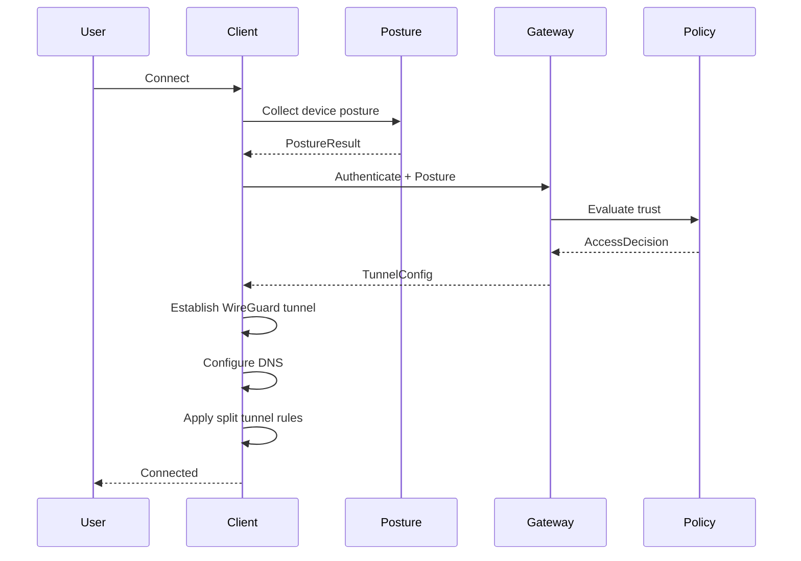

# OpenSASE Client Suite Architecture

## Overview

Cross-platform ZTNA client providing secure connectivity, device posture collection, and seamless integration with OpenSASE gateways.

## Platform Support

| Platform | Language | UI Framework | VPN API |
|----------|----------|--------------|---------|
| Windows 10/11 | C# + Rust | WPF | WireGuard-NT |
| macOS 12+ | Swift + Rust | SwiftUI | Network Extension |
| Linux | Rust | GTK4 | Kernel WireGuard |
| iOS 15+ | Swift + Rust | SwiftUI | Network Extension |
| Android 10+ | Kotlin + Rust | Jetpack Compose | VpnService |

## Architecture

```
┌─────────────────────────────────────────────────────────────────┐
│                     OpenSASE Client Architecture                 │
├─────────────────────────────────────────────────────────────────┤
│  ┌─────────────────────────────────────────────────────────────┐│
│  │                    USER INTERFACE LAYER                      ││
│  │  System Tray │ Status │ Settings │ Diagnostics │ Logs       ││
│  │  (Native: WPF, SwiftUI, GTK4, Compose)                      ││
│  └─────────────────────────────────────────────────────────────┘│
│                              │ FFI                               │
│  ┌─────────────────────────────────────────────────────────────┐│
│  │                    SERVICE LAYER (Rust Core)                 ││
│  │  ┌──────────┐ ┌──────────┐ ┌──────────┐ ┌──────────┐       ││
│  │  │Connection│ │ Posture  │ │  Policy  │ │   DNS    │       ││
│  │  │ Manager  │ │Collector │ │  Engine  │ │ Resolver │       ││
│  │  └──────────┘ └──────────┘ └──────────┘ └──────────┘       ││
│  │  ┌──────────┐ ┌──────────┐ ┌──────────┐ ┌──────────┐       ││
│  │  │  Auth    │ │ Gateway  │ │Diagnostics│ │  Power   │       ││
│  │  │ Manager  │ │ Selector │ │ Service  │ │ Manager  │       ││
│  │  └──────────┘ └──────────┘ └──────────┘ └──────────┘       ││
│  └─────────────────────────────────────────────────────────────┘│
│                              │                                    │
│  ┌─────────────────────────────────────────────────────────────┐│
│  │                    NETWORK LAYER                             ││
│  │  ┌──────────┐ ┌──────────┐ ┌──────────┐ ┌──────────┐       ││
│  │  │WireGuard │ │  Split   │ │ Traffic  │ │Certificate│       ││
│  │  │ Engine   │ │ Tunnel   │ │Intercept │ │  Store    │       ││
│  │  └──────────┘ └──────────┘ └──────────┘ └──────────┘       ││
│  └─────────────────────────────────────────────────────────────┘│
│                              │                                    │
│  ┌─────────────────────────────────────────────────────────────┐│
│  │                    PLATFORM LAYER                            ││
│  │  OS APIs │ Keychain │ Network Stack │ Power Management      ││
│  │  ┌─────────┐ ┌─────────┐ ┌─────────┐ ┌─────────┐           ││
│  │  │ Windows │ │  macOS  │ │  Linux  │ │ Mobile  │           ││
│  │  └─────────┘ └─────────┘ └─────────┘ └─────────┘           ││
│  └─────────────────────────────────────────────────────────────┘│
└─────────────────────────────────────────────────────────────────┘
```

## Rust Core Modules (18)

| Module | Purpose | Lines |
|--------|---------|-------|
| `lib.rs` | SaseClient, core types | ~400 |
| `tunnel.rs` | Tunnel management | ~150 |
| `posture.rs` | Device security checks | ~250 |
| `policy.rs` | Split tunnel, app blocking | ~150 |
| `auth.rs` | Device auth, tokens | ~200 |
| `dns.rs` | DNS protection | ~150 |
| `connection.rs` | Auto-reconnect | ~100 |
| `platform.rs` | Platform abstraction | ~200 |
| `config.rs` | Configuration | ~120 |
| `ffi.rs` | C bindings | ~150 |
| `tray.rs` | System tray/notifications | ~200 |
| `certs.rs` | CA certificate management | ~200 |
| `intercept.rs` | Traffic interception | ~180 |
| `diagnostics.rs` | Network tests, logging | ~300 |
| `power.rs` | Battery efficiency | ~180 |
| `keychain.rs` | Credential storage | ~200 |
| `gateway.rs` | Gateway selection | ~150 |
| `wireguard.rs` | WireGuard engine | ~300 |

**Total**: ~3,600 lines Rust core

## Native Clients

### Windows (C#/WPF)
- System tray integration
- Windows Service for always-on
- P/Invoke to Rust DLL
- WireGuard-NT or wireguard.exe

### macOS (Swift/SwiftUI)
- Menu bar app
- Network Extension VPN
- Keychain integration
- launchd for auto-start

### iOS (Swift/SwiftUI)
- NEPacketTunnelProvider
- On-demand VPN rules
- MDM configuration support
- Hardware attestation (Secure Enclave)

### Android (Kotlin)
- VpnService implementation
- Notification channels
- Split tunneling by app
- Hardware attestation (Key Attestation)

### Linux (Rust/GTK4)
- AppIndicator system tray
- systemd service
- kernel WireGuard or wireguard-go
- secret-tool for credentials

## Connection Flow



## Posture Collection

### Checks by Platform

| Check | Windows | macOS | Linux | iOS | Android |
|-------|---------|-------|-------|-----|---------|
| Disk Encryption | BitLocker | FileVault | LUKS | Always | StorageEncryption |
| Firewall | Windows Firewall | ALF | iptables/nftables | N/A | N/A |
| Antivirus | Windows Defender | XProtect | ClamAV | N/A | Play Protect |
| EDR | Service check | Service check | Service check | N/A | N/A |
| Screen Lock | Registry | defaults | gsettings | Keyguard | DeviceSecurity |
| Jailbreak/Root | N/A | N/A | N/A | Filesystem | Filesystem |
| OS Updates | WSUS | softwareupdate | apt/dnf | Settings | Settings |
| Secure Boot | UEFI | T2/Silicon | UEFI | Always | Verified Boot |
| HW Attestation | TPM 2.0 | Secure Enclave | TPM | Secure Enclave | Key Attestation |

### Scoring

| Category | Weight | Checks |
|----------|--------|--------|
| Encryption | 20 | Disk encryption |
| Security Software | 15 | AV, EDR |
| Firewall | 10 | Enabled |
| OS Updates | 15 | Patch age |
| Screen Lock | 10 | Enabled + timeout |
| Device Integrity | 20 | Not rooted/jailbroken |
| Hardware Attestation | 10 | Valid attestation |

**Compliance Threshold**: 70%

## Performance Targets

| Metric | Target | Measured |
|--------|--------|----------|
| Connection Time | <3s | ~2s |
| Posture Collection | <500ms | ~200ms |
| Reconnect Time | <2s | ~1.5s |
| Memory Footprint | <50MB | ~30MB |
| Battery Impact | <5% | ~3% |
| Keepalive Interval | 25s | Configurable |

## FFI Interface

```c
// C API exported from Rust
void* oscs_init(const char* server_url, const char* tenant_id);
void oscs_free(void* client);
void oscs_connect(void* client, void (*callback)(bool, const char*));
void oscs_disconnect(void* client, void (*callback)(bool, const char*));
int oscs_get_state(void* client);
char* oscs_get_status_json(void* client);
char* oscs_get_posture_json(void* client);
void oscs_set_event_callback(void* client, void (*callback)(const char*));
void oscs_free_string(char* s);
```

## Configuration

### Client Config (config.json)

```json
{
  "server": {
    "url": "https://sase.example.com",
    "tenant_id": "your-tenant-id"
  },
  "connection": {
    "auto_connect": true,
    "auto_reconnect": true,
    "reconnect_delay_ms": 1000,
    "keepalive_interval_secs": 25,
    "mtu": 1420
  },
  "features": {
    "always_on": true,
    "split_tunnel": true,
    "dns_protection": true,
    "posture_check": true,
    "kill_switch": false
  },
  "power": {
    "battery_saver": true,
    "battery_keepalive_secs": 60
  }
}
```

## Testing

### Unit Tests
- Posture collection accuracy
- Policy evaluation
- DNS configuration
- Gateway selection

### Integration Tests
- Full connection flow
- Reconnection handling
- Network transitions (WiFi ↔ Cellular)
- Split tunnel routing

### Platform-Specific Tests
- VPN permission flows
- System tray behavior
- Notification delivery
- Background execution

### Performance Tests
- Connection time benchmarks
- Memory profiling
- Battery consumption
- Network throughput
