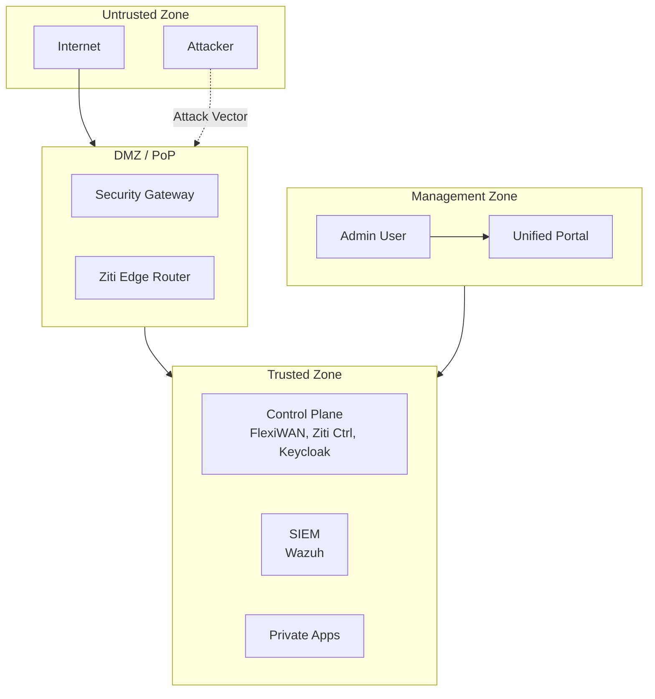

# OpenSASE-Lab Threat Model

This document identifies threats, attack surfaces, and mitigations for the OpenSASE-Lab environment.

## Scope

This threat model covers:
- The Docker Compose lab environment
- All network communications between components
- Management interfaces and APIs
- Data at rest and in transit

**Out of Scope:**
- Host OS security (assumed hardened)
- Physical security
- Supply chain attacks on container images

---

## Assets

| Asset | Sensitivity | Description |
|-------|-------------|-------------|
| Private Applications (app1, app2) | HIGH | Internal apps accessed only via ZTNA |
| Ziti PKI Keys | CRITICAL | Root CA and signing keys for ZTNA |
| Wazuh Alerts | MEDIUM | Security event data |
| Keycloak Database | HIGH | User credentials and sessions |
| FlexiWAN Device Tokens | HIGH | Edge device authentication |
| Suricata Rules | LOW | IPS detection signatures |

---

## Trust Boundaries



---

## Threat Analysis (STRIDE)

### 1. Spoofing

| Threat | Target | Mitigation |
|--------|--------|------------|
| T1.1 | Fake FlexiWAN edge enrolling | Device tokens + certificate pinning |
| T1.2 | Spoofed Ziti identity | mTLS with enrolled certificates |
| T1.3 | Forged admin login | OIDC via Keycloak + MFA (recommended) |

### 2. Tampering

| Threat | Target | Mitigation |
|--------|--------|------------|
| T2.1 | Modified Suricata rules | Read-only volume mounts, file integrity monitoring (Wazuh) |
| T2.2 | Altered Wazuh alerts | Indexed in OpenSearch with integrity checks |
| T2.3 | Compromised container image | Pin image digests, scan with Trivy |

### 3. Repudiation

| Threat | Target | Mitigation |
|--------|--------|------------|
| T3.1 | Admin denies policy change | Audit logs in Wazuh, Keycloak audit events |
| T3.2 | User denies app access | Ziti session logs with timestamps |

### 4. Information Disclosure

| Threat | Target | Mitigation |
|--------|--------|------------|
| T4.1 | Eavesdropping on WireGuard tunnel | WireGuard uses ChaCha20-Poly1305 encryption |
| T4.2 | Exposed private app | Apps have no public ports; Ziti-only access |
| T4.3 | Prometheus metrics leak | Metrics endpoint on mgmt-net only |
| T4.4 | Wazuh dashboard exposed | Behind Keycloak SSO |

### 5. Denial of Service

| Threat | Target | Mitigation |
|--------|--------|------------|
| T5.1 | Flood Ziti edge router | Rate limiting, Suricata DDoS rules |
| T5.2 | Exhaust Wazuh indexer | Log rotation, resource limits |
| T5.3 | Crash FlexiWAN controller | Container restart policies, health checks |

### 6. Elevation of Privilege

| Threat | Target | Mitigation |
|--------|--------|------------|
| T6.1 | Container escape | No `--privileged`, minimal capabilities |
| T6.2 | Admin token theft | Short-lived tokens, secure storage |
| T6.3 | Ziti policy bypass | Deny-by-default policies, policy auditing |

---

## Attack Scenarios

### Scenario 1: Compromised Branch Device

**Attack Path:**
1. Attacker gains access to branch-a workstation
2. Attempts to pivot to app2 in branch-b
3. Tries to exfiltrate data via internet

**Defenses:**
- ✅ ZTNA requires explicit identity for app2 access
- ✅ All internet traffic routed through Security PoP
- ✅ Suricata detects exfiltration patterns
- ✅ Wazuh correlates anomalous behavior

### Scenario 2: Credential Theft

**Attack Path:**
1. Phishing attack steals admin credentials
2. Attacker attempts to access FlexiWAN controller

**Defenses:**
- ✅ SSO via Keycloak (single point for MFA enforcement)
- ✅ Session timeouts and IP logging
- ✅ Audit logs sent to Wazuh
- ⚠️ **Recommendation:** Enable MFA in Keycloak

### Scenario 3: Zero-Day Exploit in Suricata

**Attack Path:**
1. Attacker crafts packet to exploit Suricata vulnerability
2. Achieves code execution in security-pop container

**Defenses:**
- ✅ Container isolation (non-root user)
- ✅ Minimal attack surface (Alpine base)
- ✅ Read-only filesystem where possible
- ✅ Wazuh monitors for anomalous processes
- ⚠️ **Recommendation:** Regular image updates

---

## Security Controls Matrix

| Control | Implementation | Status |
|---------|----------------|--------|
| Encryption in Transit | WireGuard (SD-WAN), mTLS (Ziti), TLS (APIs) | ✅ |
| Encryption at Rest | Docker volumes (host encryption recommended) | ⚠️ |
| Authentication | Keycloak OIDC, Ziti certificates, device tokens | ✅ |
| Authorization | RBAC in Keycloak, Ziti policies, nftables | ✅ |
| Audit Logging | Wazuh centralized logging | ✅ |
| Intrusion Detection | Suricata IPS | ✅ |
| Vulnerability Scanning | Manual (Trivy recommended) | ⚠️ |
| Secrets Management | .env file (Vault recommended for production) | ⚠️ |

---

## Recommendations for Production

1. **Enable MFA** in Keycloak for all admin accounts
2. **Use HashiCorp Vault** for secrets management instead of .env
3. **Enable host disk encryption** for Docker volumes
4. **Pin container image digests** to prevent supply chain attacks
5. **Deploy Trivy** for continuous vulnerability scanning
6. **Implement network segmentation** at the host/VM level
7. **Configure alerting** in Wazuh for critical events
8. **Regular penetration testing** of exposed services

---

## Incident Response Playbooks

### Playbook 1: IPS Alert - Critical Severity

```
1. Check Wazuh Dashboard for alert details
2. Identify source IP and affected service
3. If malicious:
   a. Block source in Suricata (emergency.rules)
   b. Isolate affected branch (FlexiWAN policy)
   c. Collect forensics (logs, pcap)
4. Document and report
```

### Playbook 2: Unauthorized ZTNA Access Attempt

```
1. Review Ziti audit logs
2. Identify the identity attempting access
3. If compromised identity:
   a. Revoke identity in Ziti controller
   b. Force re-enrollment
   c. Reset Keycloak credentials if linked
4. Investigate origin of compromise
```

### Playbook 3: Admin Account Compromise

```
1. Immediately disable account in Keycloak
2. Rotate all service account credentials
3. Review audit logs for unauthorized changes
4. Roll back any malicious configuration changes
5. Re-enable account only after MFA enrollment
```

---

## Threat Model Maintenance

- **Review Frequency:** Quarterly or after major changes
- **Owner:** Security Team / Lab Administrator
- **Last Updated:** 2026-01-13
