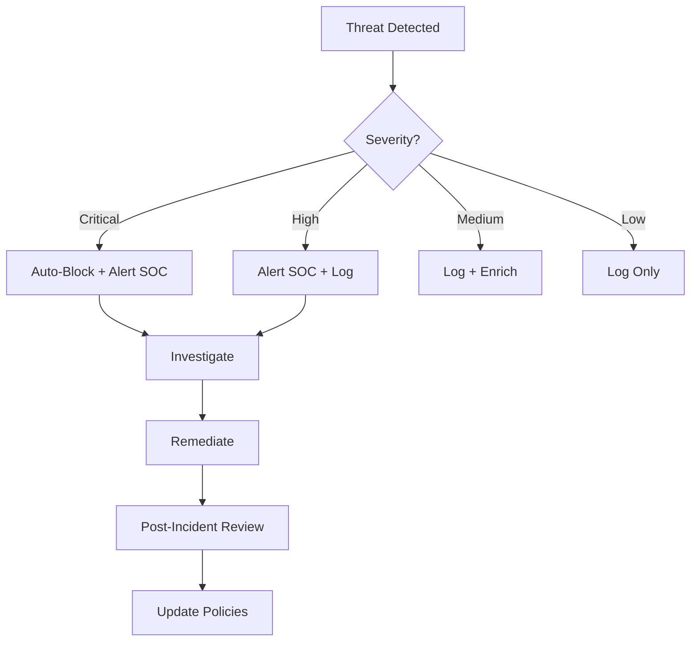

# Business Requirements Document -- SASE-SDWAN Platform
> Version: 1.0 | Last Updated: 2026-02-17 | Status: Draft
> Classification: Internal | Author: AIDD System

## 1. Business Context

### 1.1 Market Opportunity

The global SASE market is projected to reach $25 billion by 2027, growing at a CAGR of 25%. Enterprises are consolidating point security products (VPN, firewall, IPS, CASB, DLP) into unified SASE platforms. The shift to hybrid work has accelerated this trend, with 80% of enterprises planning SASE adoption by 2027.

The SD-WAN market alone is valued at $7 billion, with 40% year-over-year growth driven by branch office modernization and cloud-first strategies. Telecommunications companies and MSPs represent the fastest-growing buyer segment for white-label SASE platforms.

### 1.2 Problem Statement

Enterprises face fragmented security stacks with 6-10 separate point solutions for network security. This results in:
- Operational complexity with multiple consoles and policies
- Security gaps at integration boundaries between products
- High total cost of ownership ($150K-$500K/year for mid-market)
- Performance degradation from traffic backhauling to centralized security
- Limited visibility across the full attack surface

### 1.3 Competitive Landscape

| Vendor | Strengths | Weaknesses | Pricing Model |
|--------|-----------|------------|---------------|
| Zscaler | Cloud-native, massive PoP network | Expensive, closed-source, no SD-WAN | Per-user/year ($150-$300) |
| Palo Alto Prisma SASE | Strong security, ADEM | Complex licensing, legacy architecture | Per-user/year ($100-$250) |
| Fortinet FortiSASE | Integrated ASIC performance | On-prem heritage, limited cloud-native | Per-device + per-user |
| Cloudflare One | Developer-friendly, global network | Weaker enterprise features | Per-seat/month ($7-$18) |
| Cato Networks | Purpose-built SASE, easy deployment | Smaller PoP footprint, premium pricing | Per-site + per-user |
| **OpenSASE** | **Open-source, 100 Gbps Rust data plane, self-hosted option** | **Early stage, limited PoP coverage** | **Open core + managed service** |

### 1.4 OpenSASE Differentiation

1. **Open Source Core**: Apache-2.0 licensed, avoiding vendor lock-in
2. **Performance**: Rust + VPP/DPDK data plane targeting 100 Gbps (10x competitors)
3. **Self-Hosted Option**: Deploy on Harvester HCI for data sovereignty
4. **Developer Platform**: First-class API, SDKs, and automation tools
5. **Telco-Ready**: White-label multi-tenant architecture for MSP/telco partners
6. **Cost Efficiency**: 3-5x lower TCO than commercial alternatives

## 2. Business Objectives

### 2.1 Primary Objectives

| ID | Objective | Metric | Target | Timeline |
|----|-----------|--------|--------|----------|
| BO-01 | Establish open-source SASE platform | GitHub stars, community contributors | 5,000 stars, 100 contributors | 12 months |
| BO-02 | Launch managed SASE service | Paying customers | 50 enterprise customers | 18 months |
| BO-03 | Enable telco white-label | MSP/telco partners | 5 partner deployments | 18 months |
| BO-04 | Achieve production readiness | Feature completeness | All P0 features GA | 9 months |
| BO-05 | Build developer ecosystem | API integrations | 100 active API consumers | 12 months |

### 2.2 Revenue Model

| Stream | Description | Target Revenue (Year 1) |
|--------|-------------|------------------------|
| Managed SASE Service | Per-user/month subscription | $2M ARR |
| Enterprise Support | 24/7 support, SLA, dedicated TAM | $500K ARR |
| White-Label Licensing | Per-tenant/month for MSP partners | $1M ARR |
| Professional Services | Deployment, migration, training | $300K |
| Marketplace Add-ons | Premium connectors, integrations | $200K |

### 2.3 Pricing Tiers

| Tier | Price | Includes |
|------|-------|----------|
| Community | Free (open source) | Core platform, community support, 3 sites |
| Professional | $15/user/month | SWG, CASB, DLP, 8x5 support, 50 sites |
| Enterprise | $25/user/month | Full SASE suite, 24x7 support, 10,000 sites, SLA |
| Telco/MSP | Custom | White-label, multi-tenant, dedicated PoPs |

## 3. Stakeholder Requirements

### 3.1 Enterprise IT Requirements

| ID | Requirement | Business Justification |
|----|-------------|----------------------|
| BR-01 | Single pane of glass management | Reduce operational complexity by 60% |
| BR-02 | Sub-5-minute edge deployment | Minimize branch office downtime |
| BR-03 | 99.99% data plane availability | Meet enterprise SLA requirements |
| BR-04 | SOC 2 Type II compliance | Required for enterprise procurement |
| BR-05 | SAML/OIDC identity federation | Integrate with existing IdP (Azure AD, Okta) |
| BR-06 | Role-based access control | Segregation of duties for compliance |
| BR-07 | Comprehensive audit logging | Regulatory compliance (HIPAA, PCI DSS, GDPR) |
| BR-08 | API-first automation | Enable Infrastructure-as-Code workflows |

### 3.2 Telco/MSP Requirements

| ID | Requirement | Business Justification |
|----|-------------|----------------------|
| BR-09 | Multi-tenant architecture | Serve thousands of customers from shared infrastructure |
| BR-10 | White-label portal | Brand as own product offering |
| BR-11 | Per-tenant billing and metering | Accurate cost allocation and invoicing |
| BR-12 | Self-service tenant provisioning | Reduce onboarding from days to minutes |
| BR-13 | Tenant data isolation | Regulatory and contractual data separation |
| BR-14 | PoP deployment automation | Deploy new PoPs in < 30 minutes |
| BR-15 | Custom domain support | tenantname.provider.com portal URLs |

### 3.3 Security Team Requirements

| ID | Requirement | Business Justification |
|----|-------------|----------------------|
| BR-16 | Real-time threat detection | Mean time to detect < 10 seconds |
| BR-17 | MITRE ATT&CK framework mapping | Standardized threat classification |
| BR-18 | Threat intelligence integration | Correlate with STIX/TAXII feeds |
| BR-19 | Incident response automation | Reduce mean time to respond by 80% |
| BR-20 | Forensic evidence collection | Support post-incident investigation |
| BR-21 | Compliance reporting | Automated report generation for auditors |

## 4. Business Process Requirements

### 4.1 Customer Onboarding Journey

Target: Complete onboarding in < 2 hours for a 3-site deployment.

### 4.2 Security Incident Response Process

### 4.3 Change Management Process

All policy changes follow:
1. Draft policy in staging environment
2. Validate with dry-run simulation
3. Approval workflow (2-person rule for critical policies)
4. Staged rollout (canary -> 10% -> 50% -> 100%)
5. Automated rollback on error threshold breach

## 5. Regulatory and Compliance Requirements

| Regulation | Requirement | Platform Feature |
|------------|-------------|-----------------|
| GDPR | Data residency, right to erasure | Self-hosted PoPs, tenant data isolation |
| HIPAA | Encryption, access controls, audit trails | TLS everywhere, RBAC, audit logging |
| PCI DSS | Network segmentation, log retention | Per-tenant VRFs, 1-year log retention |
| SOC 2 Type II | Security controls, monitoring | Continuous monitoring, change management |
| FedRAMP | FIPS 140-2 crypto, US data residency | FIPS mode, US PoP options |
| NIST 800-207 | Zero trust architecture | ZTNA with continuous verification |

## 6. Integration Requirements

### 6.1 Identity Providers
- Azure Active Directory / Entra ID
- Okta
- Google Workspace
- Any SAML 2.0 / OIDC provider
- LDAP / Active Directory (on-premise)

### 6.2 SIEM/SOAR Platforms
- Splunk (via HEC)
- Microsoft Sentinel (via API)
- IBM QRadar (via Syslog)
- Native Wazuh integration

### 6.3 ITSM Platforms
- ServiceNow
- Jira Service Management
- PagerDuty (alerting)

### 6.4 Cloud Platforms
- AWS (VPC, Transit Gateway)
- Azure (VNet, Virtual WAN)
- GCP (VPC, Cloud Interconnect)

## 7. Success Criteria

### 7.1 Technical KPIs

| KPI | Target |
|-----|--------|
| Platform uptime | 99.95% |
| Mean time to provision new site | < 5 minutes |
| Mean time to detect threats | < 10 seconds |
| Mean time to mitigate threats | < 60 seconds |
| False positive rate | < 5% |
| API latency P95 | < 50ms |

### 7.2 Business KPIs

| KPI | Target (Year 1) |
|-----|-----------------|
| Annual Recurring Revenue | $3.5M |
| Customer retention rate | > 95% |
| Net Promoter Score | > 50 |
| Customer onboarding time | < 2 hours |
| Support ticket resolution time | < 4 hours (P1) |
| Community GitHub stars | 5,000 |

## 8. Budget and Resource Requirements

### 8.1 Development Team

| Role | Headcount | Focus Area |
|------|-----------|------------|
| Rust Engineers | 6 | opensase-core data plane, edge, ML |
| Platform Engineers | 3 | K8s, infrastructure, CI/CD |
| Frontend Engineers | 2 | Portal, mobile clients |
| Security Engineers | 2 | Threat models, penetration testing |
| DevOps Engineers | 2 | Deployment automation, monitoring |
| Technical Writer | 1 | Documentation, API guides |
| Product Manager | 1 | Roadmap, customer feedback |

### 8.2 Infrastructure Costs (Year 1)

| Item | Monthly Cost |
|------|-------------|
| PoP hosting (3 locations, bare metal) | $15,000 |
| CI/CD (GitHub Actions, build runners) | $2,000 |
| Monitoring (Grafana Cloud) | $1,000 |
| Domain and certificates | $500 |
| Security tools (Snyk, SonarQube) | $1,500 |
| **Total Monthly** | **$20,000** |

## 9. Risk Analysis

| Risk | Probability | Impact | Mitigation |
|------|-------------|--------|------------|
| Open-source competitors emerge | High | Medium | Move fast, build community, focus on performance |
| Enterprise adoption slower than planned | Medium | High | Partner with MSPs for distribution |
| Regulatory requirements change | Low | Medium | Modular compliance framework |
| Key talent attrition | Medium | High | Open-source community, competitive compensation |
| Security vulnerability in platform | Low | Critical | Bug bounty program, regular penetration testing |

## 10. Approval and Sign-Off

| Role | Name | Date | Signature |
|------|------|------|-----------|
| Product Owner | | | |
| Engineering Lead | | | |
| Security Lead | | | |
| Business Sponsor | | | |
