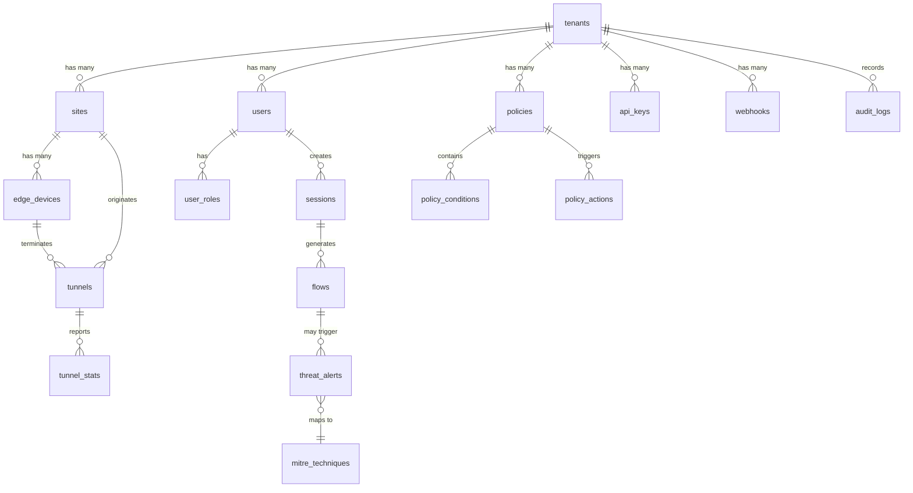

# Database Schema -- SASE-SDWAN Platform
> Version: 1.0 | Last Updated: 2026-02-17 | Status: Draft
> Classification: Internal | Author: AIDD System

## 1. Overview

OpenSASE uses a polyglot persistence strategy. This document defines the schema for the primary operational database (YugabyteDB), the high-throughput session store (ScyllaDB), and the analytics warehouse (ClickHouse). Current state uses MongoDB (FlexiWAN) and PostgreSQL (Keycloak).

## 2. Entity Relationship Diagram



## 3. YugabyteDB Schema (Operational Data)

### 3.1 Tenants Table

```sql
CREATE TABLE tenants (
    id UUID PRIMARY KEY DEFAULT gen_random_uuid(),
    name VARCHAR(255) NOT NULL,
    slug VARCHAR(100) UNIQUE NOT NULL,
    plan VARCHAR(50) NOT NULL DEFAULT 'community',
    status VARCHAR(20) NOT NULL DEFAULT 'active',
    max_sites INTEGER NOT NULL DEFAULT 3,
    max_users INTEGER NOT NULL DEFAULT 10,
    settings JSONB NOT NULL DEFAULT '{}',
    created_at TIMESTAMPTZ NOT NULL DEFAULT NOW(),
    updated_at TIMESTAMPTZ NOT NULL DEFAULT NOW()
);

CREATE INDEX idx_tenants_slug ON tenants(slug);
CREATE INDEX idx_tenants_status ON tenants(status);
```

### 3.2 Users Table

```sql
CREATE TABLE users (
    id UUID PRIMARY KEY DEFAULT gen_random_uuid(),
    tenant_id UUID NOT NULL REFERENCES tenants(id) ON DELETE CASCADE,
    email VARCHAR(255) NOT NULL,
    name VARCHAR(255) NOT NULL,
    role VARCHAR(50) NOT NULL DEFAULT 'viewer',
    mfa_enabled BOOLEAN NOT NULL DEFAULT false,
    status VARCHAR(20) NOT NULL DEFAULT 'active',
    keycloak_id VARCHAR(255),
    last_login TIMESTAMPTZ,
    created_at TIMESTAMPTZ NOT NULL DEFAULT NOW(),
    updated_at TIMESTAMPTZ NOT NULL DEFAULT NOW(),
    UNIQUE(tenant_id, email)
);

CREATE INDEX idx_users_tenant ON users(tenant_id);
CREATE INDEX idx_users_email ON users(tenant_id, email);
CREATE INDEX idx_users_keycloak ON users(keycloak_id);
```

Roles from `api/src/models.rs`: `Admin`, `Editor`, `Viewer`, `ServiceAccount`.

### 3.3 Sites Table

```sql
CREATE TABLE sites (
    id UUID PRIMARY KEY DEFAULT gen_random_uuid(),
    tenant_id UUID NOT NULL REFERENCES tenants(id) ON DELETE CASCADE,
    name VARCHAR(255) NOT NULL,
    location VARCHAR(500),
    timezone VARCHAR(100) DEFAULT 'UTC',
    status VARCHAR(20) NOT NULL DEFAULT 'provisioning',
    edge_count INTEGER NOT NULL DEFAULT 0,
    user_count INTEGER NOT NULL DEFAULT 0,
    config JSONB NOT NULL DEFAULT '{}',
    created_at TIMESTAMPTZ NOT NULL DEFAULT NOW(),
    updated_at TIMESTAMPTZ NOT NULL DEFAULT NOW()
);

CREATE INDEX idx_sites_tenant ON sites(tenant_id);
CREATE INDEX idx_sites_status ON sites(tenant_id, status);
```

Status values from `api/src/models.rs`: `Active`, `Degraded`, `Offline`, `Provisioning`.

### 3.4 Edge Devices Table

```sql
CREATE TABLE edge_devices (
    id UUID PRIMARY KEY DEFAULT gen_random_uuid(),
    site_id UUID NOT NULL REFERENCES sites(id) ON DELETE CASCADE,
    tenant_id UUID NOT NULL REFERENCES tenants(id) ON DELETE CASCADE,
    name VARCHAR(255) NOT NULL,
    serial_number VARCHAR(100) UNIQUE,
    model VARCHAR(100),
    firmware_version VARCHAR(50),
    status VARCHAR(20) NOT NULL DEFAULT 'offline',
    wan_interfaces JSONB NOT NULL DEFAULT '[]',
    lan_interfaces JSONB NOT NULL DEFAULT '[]',
    public_key VARCHAR(500),
    last_heartbeat TIMESTAMPTZ,
    config JSONB NOT NULL DEFAULT '{}',
    created_at TIMESTAMPTZ NOT NULL DEFAULT NOW(),
    updated_at TIMESTAMPTZ NOT NULL DEFAULT NOW()
);

CREATE INDEX idx_edges_site ON edge_devices(site_id);
CREATE INDEX idx_edges_tenant ON edge_devices(tenant_id);
CREATE INDEX idx_edges_serial ON edge_devices(serial_number);
```

### 3.5 Tunnels Table

```sql
CREATE TABLE tunnels (
    id UUID PRIMARY KEY DEFAULT gen_random_uuid(),
    tenant_id UUID NOT NULL REFERENCES tenants(id) ON DELETE CASCADE,
    name VARCHAR(255) NOT NULL,
    tunnel_type VARCHAR(50) NOT NULL DEFAULT 'wireguard',
    status VARCHAR(20) NOT NULL DEFAULT 'down',
    source_device_id UUID REFERENCES edge_devices(id),
    source_ip INET NOT NULL,
    destination_ip INET NOT NULL,
    destination_pop VARCHAR(100),
    encryption VARCHAR(50) DEFAULT 'chacha20-poly1305',
    mtu INTEGER DEFAULT 1420,
    keepalive_interval INTEGER DEFAULT 25,
    created_at TIMESTAMPTZ NOT NULL DEFAULT NOW(),
    updated_at TIMESTAMPTZ NOT NULL DEFAULT NOW()
);

CREATE INDEX idx_tunnels_tenant ON tunnels(tenant_id);
CREATE INDEX idx_tunnels_device ON tunnels(source_device_id);
CREATE INDEX idx_tunnels_status ON tunnels(tenant_id, status);
```

### 3.6 Policies Table

```sql
CREATE TABLE policies (
    id UUID PRIMARY KEY DEFAULT gen_random_uuid(),
    tenant_id UUID NOT NULL REFERENCES tenants(id) ON DELETE CASCADE,
    name VARCHAR(255) NOT NULL,
    description TEXT DEFAULT '',
    enabled BOOLEAN NOT NULL DEFAULT true,
    priority INTEGER NOT NULL DEFAULT 100,
    policy_type VARCHAR(50) NOT NULL,
    action VARCHAR(20) NOT NULL DEFAULT 'allow',
    version INTEGER NOT NULL DEFAULT 1,
    conditions JSONB NOT NULL DEFAULT '[]',
    metadata JSONB NOT NULL DEFAULT '{}',
    created_by UUID REFERENCES users(id),
    created_at TIMESTAMPTZ NOT NULL DEFAULT NOW(),
    updated_at TIMESTAMPTZ NOT NULL DEFAULT NOW()
);

CREATE INDEX idx_policies_tenant ON policies(tenant_id);
CREATE INDEX idx_policies_type ON policies(tenant_id, policy_type);
CREATE INDEX idx_policies_priority ON policies(tenant_id, priority);
```

Policy actions from `api/src/models.rs`: `Allow`, `Block`, `Isolate`, `Log`.

### 3.7 API Keys Table

```sql
CREATE TABLE api_keys (
    id UUID PRIMARY KEY DEFAULT gen_random_uuid(),
    tenant_id UUID NOT NULL REFERENCES tenants(id) ON DELETE CASCADE,
    name VARCHAR(255) NOT NULL,
    key_hash VARCHAR(500) NOT NULL,
    key_prefix VARCHAR(20) NOT NULL,
    scopes TEXT[] NOT NULL DEFAULT '{}',
    expires_at TIMESTAMPTZ,
    last_used TIMESTAMPTZ,
    created_by UUID REFERENCES users(id),
    created_at TIMESTAMPTZ NOT NULL DEFAULT NOW()
);

CREATE INDEX idx_api_keys_tenant ON api_keys(tenant_id);
CREATE INDEX idx_api_keys_prefix ON api_keys(key_prefix);
```

### 3.8 Webhooks Table

```sql
CREATE TABLE webhooks (
    id UUID PRIMARY KEY DEFAULT gen_random_uuid(),
    tenant_id UUID NOT NULL REFERENCES tenants(id) ON DELETE CASCADE,
    url VARCHAR(2000) NOT NULL,
    secret VARCHAR(500) NOT NULL,
    events TEXT[] NOT NULL DEFAULT '{}',
    enabled BOOLEAN NOT NULL DEFAULT true,
    failure_count INTEGER NOT NULL DEFAULT 0,
    last_delivery_at TIMESTAMPTZ,
    created_at TIMESTAMPTZ NOT NULL DEFAULT NOW()
);

CREATE INDEX idx_webhooks_tenant ON webhooks(tenant_id);
```

### 3.9 Audit Logs Table

```sql
CREATE TABLE audit_logs (
    id UUID PRIMARY KEY DEFAULT gen_random_uuid(),
    tenant_id UUID NOT NULL REFERENCES tenants(id),
    user_id UUID REFERENCES users(id),
    action VARCHAR(100) NOT NULL,
    resource_type VARCHAR(100) NOT NULL,
    resource_id UUID,
    details JSONB NOT NULL DEFAULT '{}',
    ip_address INET,
    user_agent VARCHAR(500),
    created_at TIMESTAMPTZ NOT NULL DEFAULT NOW()
) PARTITION BY RANGE (created_at);

CREATE INDEX idx_audit_tenant ON audit_logs(tenant_id, created_at DESC);
CREATE INDEX idx_audit_user ON audit_logs(user_id, created_at DESC);
```

## 4. ScyllaDB Schema (High-Throughput Data)

### 4.1 Sessions Table

```cql
CREATE TABLE opensase.sessions (
    tenant_id UUID,
    session_id UUID,
    user_id UUID,
    device_id UUID,
    source_ip INET,
    started_at TIMESTAMP,
    last_activity TIMESTAMP,
    status TEXT,
    metadata MAP<TEXT, TEXT>,
    PRIMARY KEY ((tenant_id), session_id)
) WITH default_time_to_live = 86400;
```

### 4.2 Flow Records Table

```cql
CREATE TABLE opensase.flows (
    tenant_id UUID,
    pop_id TEXT,
    timestamp TIMESTAMP,
    flow_id UUID,
    source_ip INET,
    destination_ip INET,
    source_port INT,
    destination_port INT,
    protocol INT,
    bytes_sent BIGINT,
    bytes_received BIGINT,
    packets_sent BIGINT,
    packets_received BIGINT,
    application TEXT,
    action TEXT,
    PRIMARY KEY ((tenant_id, pop_id), timestamp, flow_id)
) WITH CLUSTERING ORDER BY (timestamp DESC)
  AND default_time_to_live = 604800;
```

### 4.3 Tunnel Statistics Table

```cql
CREATE TABLE opensase.tunnel_stats (
    tunnel_id UUID,
    timestamp TIMESTAMP,
    latency_ms INT,
    jitter_ms INT,
    packet_loss_percent FLOAT,
    rx_bytes BIGINT,
    tx_bytes BIGINT,
    uptime_seconds BIGINT,
    PRIMARY KEY ((tunnel_id), timestamp)
) WITH CLUSTERING ORDER BY (timestamp DESC)
  AND default_time_to_live = 2592000;
```

## 5. ClickHouse Schema (Analytics)

### 5.1 Traffic Analytics

```sql
CREATE TABLE traffic_analytics (
    tenant_id UUID,
    pop_id String,
    timestamp DateTime,
    total_bytes UInt64,
    total_requests UInt64,
    blocked_requests UInt64,
    application String,
    category String
) ENGINE = MergeTree()
PARTITION BY toYYYYMM(timestamp)
ORDER BY (tenant_id, pop_id, timestamp);
```

### 5.2 Threat Analytics

```sql
CREATE TABLE threat_analytics (
    tenant_id UUID,
    timestamp DateTime,
    threat_category String,
    severity String,
    source_ip IPv4,
    destination_ip IPv4,
    mitre_technique String,
    alert_id UUID,
    details String
) ENGINE = MergeTree()
PARTITION BY toYYYYMM(timestamp)
ORDER BY (tenant_id, timestamp);
```

## 6. Migration Strategy

### 6.1 Current State
- MongoDB 6: FlexiWAN controller data (`flexiwan-mongo-data` volume)
- PostgreSQL 15: Keycloak identity data (`keycloak-db-data` volume)
- In-memory: Portal backend state (Rust `Arc<RwLock<Vec<T>>>`)

### 6.2 Target State
- YugabyteDB: All operational data (tenants, users, policies, sites, tunnels)
- ScyllaDB: High-throughput session and flow data
- ClickHouse: Analytics and reporting
- DragonflyDB: Caching layer
- MongoDB 6: Retained for FlexiWAN compatibility
- PostgreSQL 15: Retained for Keycloak

### 6.3 Migration Steps
1. Deploy YugabyteDB cluster (3 nodes)
2. Create schemas and indexes
3. Migrate portal in-memory state to YugabyteDB
4. Deploy ScyllaDB cluster (3 nodes)
5. Configure flow record ingestion
6. Deploy ClickHouse for analytics
7. Build ETL pipeline from ScyllaDB to ClickHouse

## 7. Data Governance

### 7.1 Tenant Isolation
All tables include `tenant_id` as a required column. Row-level security (RLS) policies enforce tenant boundary:
```sql
CREATE POLICY tenant_isolation ON users
    USING (tenant_id = current_setting('app.current_tenant')::UUID);
```

### 7.2 Retention Policies
| Data Type | Retention | Purge Method |
|-----------|-----------|--------------|
| Operational (tenants, policies) | Indefinite | Manual delete |
| Sessions | 24 hours | ScyllaDB TTL |
| Flow records | 7 days | ScyllaDB TTL |
| Tunnel stats | 30 days | ScyllaDB TTL |
| Analytics | 1 year | ClickHouse partition drop |
| Audit logs | 7 years | Table partitioning |
| SIEM alerts | 1 year | Wazuh index lifecycle |
