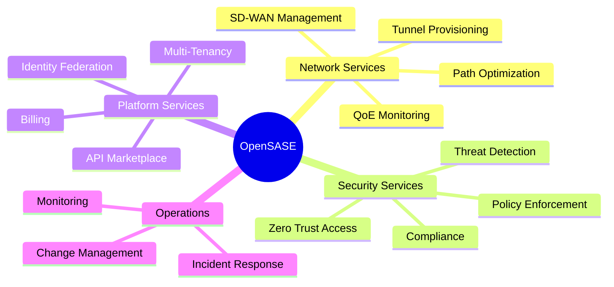
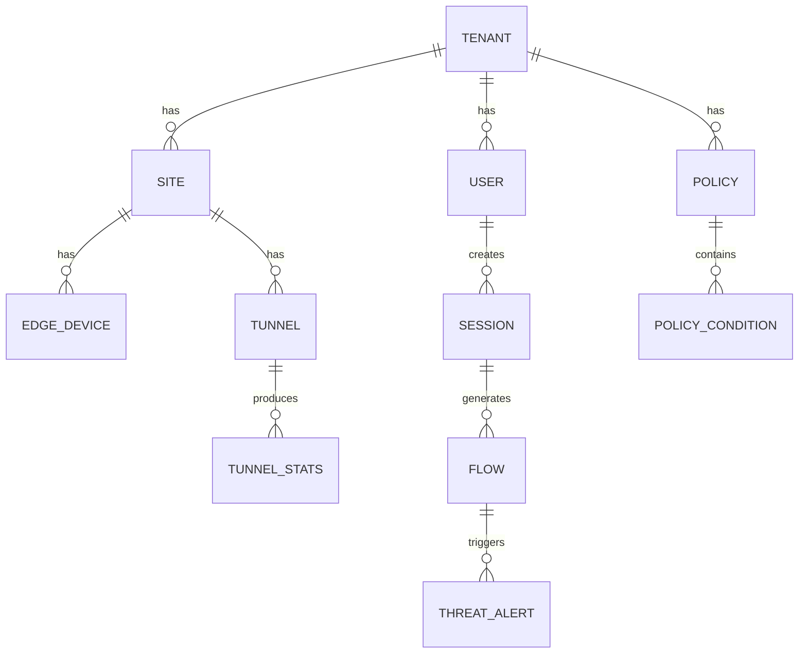

# Enterprise Architecture -- SASE-SDWAN Platform
> Version: 1.0 | Last Updated: 2026-02-17 | Status: Draft
> Classification: Internal | Author: AIDD System

## 1. TOGAF Framework Alignment

This document maps OpenSASE to TOGAF Architecture Development Method (ADM) layers.

## 2. Business Architecture Layer

### 2.1 Business Capabilities

### 2.2 Value Streams

| Value Stream | Metric |
|-------------|--------|
| Site Onboarding | Time to connect < 5 min |
| Threat Mitigation | Time to mitigate < 60 sec |
| Policy Deployment | Time to enforce < 30 sec |
| Incident Resolution | MTTR < 4 hours |
| Tenant Provisioning | Time to activate < 2 hours |

### 2.3 Teams to Components Mapping

| Team | Components |
|------|-----------|
| Network Engineering | `edge/`, `sase-sdwan`, `sase-path`, `sase-backbone` |
| Security Engineering | `sase-ztna`, `sase-ips`, `sase-dlp`, `sase-casb`, `ml/` |
| Platform Engineering | `api/`, `portal/`, `sase-tenant`, `sase-billing` |
| Infrastructure | `infra/`, `docker/`, `scripts/` |
| Client Engineering | `opensase-clients/`, `client/`, `cli/` |

## 3. Application Architecture Layer

### 3.1 Application Portfolio

| Application | Status | Maturity | Source |
|------------|--------|----------|--------|
| Docker Compose Lab | Production-ready | Lab | `docker-compose.yml` |
| API Gateway (Rust) | Prototype | Alpha | `api/src/` |
| Portal (React) | Prototype | Alpha | `opensase-portal/` |
| Edge Appliance (Rust) | Prototype | Alpha | `edge/src/` |
| ML Threat Engine | Prototype | Alpha | `ml/inference/` |
| Core Platform (45 crates) | In Progress | Pre-Alpha | `opensase-core/crates/` |
| Mobile Clients | Scaffold | Pre-Alpha | `opensase-clients/` |

### 3.2 Integration Map

| Source | Target | Protocol |
|--------|--------|----------|
| Portal Frontend | Portal Backend | REST + WebSocket |
| Portal Backend | FlexiWAN | REST proxy |
| Portal Backend | OpenZiti | REST proxy |
| Portal Backend | Wazuh | REST proxy |
| API Gateway | VPP Gateway | gRPC |
| Policy Engine | Edges | NATS pub/sub |
| All Services | Prometheus | HTTP scrape |

## 4. Data Architecture Layer

### 4.1 Data Domains

### 4.2 Data Classification

| Classification | Storage | Retention | Encryption |
|---------------|---------|-----------|------------|
| Confidential (credentials, keys) | YugabyteDB | Indefinite | AES-256-GCM |
| Restricted (policies, configs) | YugabyteDB | Indefinite | AES-256-GCM |
| Internal (flows, sessions) | ScyllaDB + ClickHouse | 90 days | At rest |
| Public (docs, APIs) | Static files | Indefinite | None |

## 5. Technology Architecture Layer

### 5.1 Standards

| Category | Standard |
|----------|----------|
| Core Language | Rust 2021 Edition |
| UI Language | TypeScript 5.3+ |
| Components | Python 3.11+ |
| Container Runtime | Docker 24.0+ / containerd |
| Orchestration | Kubernetes 1.29+ (Talos) |
| CNI | Cilium 1.15+ |
| OS (PoP) | Talos Linux |
| IaC | Terraform + Ansible |
| GitOps | Rancher Fleet |

### 5.2 Architecture Decision Records

| ADR | Decision | Rationale |
|-----|----------|-----------|
| ADR-001 | Rust as primary language | Memory safety, C-level performance, no GC |
| ADR-002 | VPP/DPDK for data plane | 100 Gbps requirement |
| ADR-003 | Cargo workspace monorepo | Shared deps, atomic versions |
| ADR-004 | Keycloak for identity | Mature OIDC/SAML, self-hosted |
| ADR-005 | Event-driven (Redpanda + NATS) | Decoupled services, burst handling |
| ADR-006 | XDP for DDoS mitigation | Line-rate filtering at NIC level |

### 5.3 Technology Radar

- **Adopt**: Rust, Tokio, Axum, Cilium, Talos Linux
- **Trial**: VPP/DPDK, eBPF/XDP, Candle ML, Redpanda
- **Assess**: WebAssembly plugins, Tauri 2.0
- **Hold**: Python for data plane, kernel networking

## 6. Capability Maturity Assessment

| Capability | Current | Target | Gap |
|-----------|---------|--------|-----|
| SD-WAN | 3 (Lab) | 5 (Prod) | Native path selection |
| ZTNA | 3 (Lab) | 5 (Prod) | Native Rust impl |
| SWG | 2 (Proto) | 4 (Integrated) | URL categorization |
| CASB | 2 (Proto) | 4 (Integrated) | Inline mode |
| DLP | 2 (Proto) | 4 (Integrated) | ML classifiers |
| Multi-Tenancy | 1 (None) | 5 (Prod) | Full isolation |
| Observability | 3 (Lab) | 5 (Prod) | OTel, tracing |
| CI/CD | 1 (None) | 5 (Prod) | Full pipeline |

## 7. Governance

Architecture Review Board reviews all ADRs. Monthly reviews required. Approval needed for new crate additions to workspace.

## 8. Roadmap

| Phase | Timeline | Focus |
|-------|----------|-------|
| Q1 2026 | Architecture Vision | Gap analysis, target architecture |
| Q2 2026 | Data + Business | Multi-tenancy, database migration |
| Q3 2026 | Application + Technology | VPP integration, security stack |
| Q4 2026 | Implementation Governance | Production hardening, SLAs |
