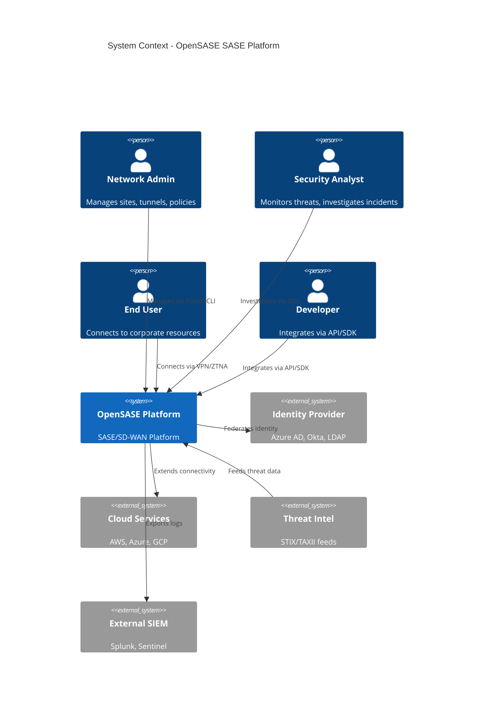
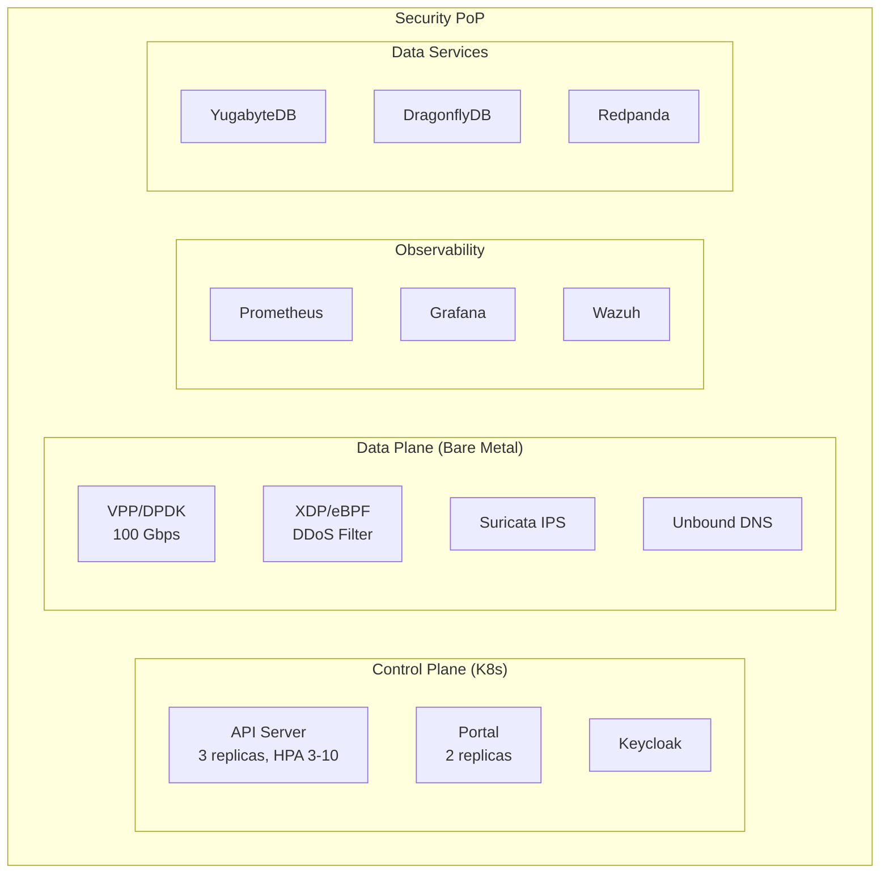

# High-Level Design -- SASE-SDWAN Platform
> Version: 1.0 | Last Updated: 2026-02-17 | Status: Draft
> Classification: Internal | Author: AIDD System

## 1. System Context

OpenSASE operates as a converged SASE platform serving three tiers: cloud-based PoPs, branch edge appliances, and end-user clients. The platform unifies SD-WAN, ZTNA, SWG, CASB, DLP, FWaaS, and SOC capabilities.



## 2. Network Topology Design

### 2.1 PoP Architecture

Each Point of Presence (PoP) runs the full security stack:



### 2.2 Multi-PoP Backbone

PoPs interconnect via Cilium ClusterMesh over dedicated backbone links. BGP peering at IXPs provides optimal traffic routing. From `infra/k8s/clustermesh/config.yaml` and `docs/IXP_PEERING_ARCHITECTURE.md`.

### 2.3 Branch Edge Design

From `edge/src/lib.rs`, each branch runs an `OpenSASEEdge` appliance:
- Multi-WAN: WAN1 (primary), WAN2 (backup), LTE (failover)
- Local security: Firewall, IPS, URL filter, app control, DNS
- SD-WAN: QoE-based path selection, traffic steering
- HA: Active/passive failover via `ha.rs`

## 3. Security Layer Design

### 3.1 Defense in Depth Layers

| Layer | Component | Location | Function |
|-------|-----------|----------|----------|
| L1 | XDP/eBPF | NIC driver | DDoS mitigation, rate limiting |
| L2 | VPP Firewall | Data plane | L3/L4 stateful firewall |
| L3 | Suricata IPS | Data plane | Signature-based threat detection |
| L4 | DLP Engine | Data plane | Content scanning (sase-dlp) |
| L5 | SWG | Data plane | URL filtering, SSL inspection |
| L6 | CASB | Application | SaaS security monitoring |
| L7 | ZTNA | Application | Identity-based access control |
| L8 | ML Engine | Analytics | Behavioral anomaly detection |

### 3.2 Zero Trust Model

From `docs/ZTNA_ARCHITECTURE.md` and OpenZiti configuration:
- All services are "dark" (no public IP or port)
- mTLS end-to-end via OpenZiti fabric
- Identity verified at every session
- Posture checks: OS version, antivirus, disk encryption
- Continuous trust scoring updates based on behavior

## 4. Traffic Flow Design

### 4.1 Ingress Traffic (Branch to Internet)

```
Branch User -> Edge Appliance (local policy check)
    -> WireGuard Tunnel (ChaCha20-Poly1305)
    -> PoP XDP Classifier (DDoS check)
    -> VPP Forwarding Engine
    -> Suricata IPS (signature check)
    -> Unbound DNS (domain filtering)
    -> DLP Scanner (content check)
    -> Internet
```

### 4.2 ZTNA Traffic (User to Private App)

```
Remote User -> Desktop Client (client/core)
    -> OIDC Authentication (Keycloak)
    -> Ziti Controller (policy evaluation)
    -> Ziti Router PoP (mTLS session)
    -> Ziti Fabric (encrypted relay)
    -> Ziti Router Branch (local delivery)
    -> Private App (no public exposure)
```

### 4.3 Management Traffic

```
Admin Browser -> Portal Frontend (:8080)
    -> Portal Backend (Rust/Axum)
    -> API Gateway (api/src/)
    -> Individual Services (FlexiWAN, Ziti, Wazuh)
```

## 5. High Availability Design

### 5.1 Control Plane HA

From `infra/k8s/services/opensase-control-plane.yaml`:
- API Server: 3 replicas, PDB minAvailable=2, pod anti-affinity
- Portal: 2 replicas, PDB minAvailable=1
- HPA: Scale 3-10 based on CPU (70%) and memory (80%)

### 5.2 Data Plane HA

- VPP: Active/standby with VRRP
- XDP: Loaded on all NICs independently
- Suricata: Multiple workers, AF_PACKET cluster mode

### 5.3 Edge HA

From `edge/src/ha.rs`:
- Active/passive pair
- Heartbeat monitoring
- Failover < 3 seconds
- State synchronization via NATS

### 5.4 Database HA

- YugabyteDB: 3 tablet servers, RF=3
- ScyllaDB: 3 nodes, RF=3
- DragonflyDB: Primary/replica

## 6. Scalability Design

| Component | Scaling Strategy | Max Scale |
|-----------|-----------------|-----------|
| API Server | HPA (CPU/memory) | 10 replicas per PoP |
| Portal | HPA | 5 replicas per PoP |
| VPP | Vertical (more cores) | 100 Gbps per instance |
| Edge | Horizontal (more sites) | 10,000 sites per tenant |
| YugabyteDB | Add tablet servers | Petabyte scale |
| Redpanda | Add brokers | 1M events/sec |

## 7. Integration Design

### 7.1 Service Port Map

From `docker-compose.yml`:

| Port | Service | Protocol |
|------|---------|----------|
| 3000 | FlexiWAN Controller | HTTP |
| 3001 | Grafana | HTTP |
| 5601 | Wazuh Dashboard | HTTP |
| 8080 | Portal Frontend | HTTP |
| 8000 | Portal Backend (Python) | HTTP |
| 8443 | Keycloak | HTTP |
| 9090 | Prometheus | HTTP |
| 1280 | OpenZiti Controller | HTTPS |
| 3022 | Ziti Router PoP | HTTPS |
| 1514 | Wazuh Agent Syslog | UDP |
| 1515 | Wazuh Agent Registration | TCP |
| 55000 | Wazuh API | HTTPS |
| 4433 | FlexiWAN Device Mgmt | HTTPS |

### 7.2 External Integrations

| Integration | Protocol | Component |
|-------------|----------|-----------|
| Identity Federation | OIDC/SAML 2.0 | Keycloak |
| Threat Intel Feeds | STIX/TAXII | sase-threat-intel |
| SIEM Export | Syslog/CEF | Wazuh |
| Cloud Connectivity | VPC Peering | sase-cloud-connector |
| Automation | REST API | api/src/ |
| IaC | Terraform | terraform/opensase/ |

## 8. Monitoring and Observability Design

### 8.1 Metrics Pipeline

```
Service Metrics -> Prometheus Scrape -> Grafana Dashboards
                                    -> AlertManager -> PagerDuty/Slack
```

### 8.2 Logging Pipeline

```
Application Logs -> Redpanda -> Quickwit (search)
Security Logs -> Wazuh Manager -> Wazuh Indexer (OpenSearch)
                                -> Wazuh Dashboard
```

### 8.3 Dashboards

From `docker/grafana/dashboards/overview.json`:
- SD-WAN Overview: tunnel health, bandwidth, latency
- Security PoP: IPS alerts, DNS queries blocked
- ZTNA Sessions: active sessions, policy decisions
- System Health: CPU, memory, disk, network per service

## 9. Deployment Topology

### 9.1 Lab (Docker Compose)

20+ containers on a single host:
```
make up        # Full stack (16GB RAM)
make lite      # Reduced resources (8GB RAM)
make up-sdwan  # SD-WAN components only
make up-ztna   # ZTNA components only
make up-siem   # Wazuh SIEM only
```

### 9.2 Production (Kubernetes)

Per-PoP Talos Linux cluster:
- 3 control plane nodes
- 3+ worker nodes
- 2 dedicated VPP/DPDK nodes with SR-IOV
- Cilium CNI with L7 policies
- ClusterMesh for multi-PoP connectivity

### 9.3 Self-Hosted (Harvester HCI)

From `opensase-core/k8s/harvester-config.yaml`:
- Harvester provides VM management + K8s
- SR-IOV for NIC passthrough to VPP VMs
- Integrated storage via Longhorn
