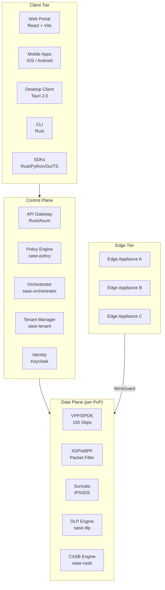

# Product Requirements Document -- SASE-SDWAN Platform
> Version: 1.0 | Last Updated: 2026-02-17 | Status: Draft
> Classification: Internal | Author: AIDD System

## 1. Product Vision

OpenSASE is an open-source, enterprise-grade Secure Access Service Edge (SASE) platform that converges SD-WAN, Zero Trust Network Access (ZTNA), Secure Web Gateway (SWG), Cloud Access Security Broker (CASB), Firewall as a Service (FWaaS), Data Loss Prevention (DLP), and Security Operations Center (SOC) into a single cloud-native platform. Built on a high-performance Rust data plane with eBPF/XDP acceleration, OpenSASE targets 100 Gbps throughput with sub-microsecond policy evaluation latency.

## 2. Target Users

### 2.1 Primary Personas

| Persona | Role | Key Needs |
|---------|------|-----------|
| Network Administrator | Manages SD-WAN tunnels, routing policies, PoP topology | Single pane of glass, zero-touch provisioning, path quality monitoring |
| Security Analyst | Monitors threats, investigates incidents, manages security policies | Real-time alerts, MITRE ATT&CK mapping, threat hunting |
| IT Director | Oversees enterprise connectivity and security posture | Compliance dashboards, cost optimization, vendor consolidation |
| End User | Connects to corporate resources remotely | Seamless VPN client, fast connectivity, minimal friction |
| Developer | Integrates SASE services into applications | REST API, SDKs (Rust/Python/Go/TypeScript), webhooks, CLI |
| MSP/MSSP Operator | Manages multiple tenant environments | Multi-tenancy, white-label portal, per-tenant billing |

### 2.2 Target Organizations
- Mid-market enterprises (500-5000 employees)
- Managed Service Providers (MSPs)
- Telecommunications companies building SASE offerings
- Government agencies requiring zero-trust compliance

## 3. Core Feature Requirements

### 3.1 SD-WAN (PR-100 Series)

| ID | Feature | Priority | Acceptance Criteria |
|----|---------|----------|---------------------|
| PR-101 | WireGuard-based IPsec overlay tunnels | P0 | Tunnels establish in < 5 seconds, survive link failover |
| PR-102 | Multi-WAN path selection with QoE scoring | P0 | Voice traffic achieves < 30ms latency, < 1% loss |
| PR-103 | Application-aware routing | P0 | Top 1000 applications identified by DPI signatures |
| PR-104 | Zero-touch provisioning (ZTP) | P1 | Edge device auto-configures from USB/cloud bootstrap |
| PR-105 | Link bonding and load balancing | P1 | Aggregate bandwidth across 2+ WAN links |
| PR-106 | Traffic shaping and QoS | P1 | Per-application bandwidth limits enforced |
| PR-107 | Edge high availability (active/passive) | P2 | Failover completes in < 3 seconds |
| PR-108 | Branch-to-branch direct tunnels | P2 | Dynamic mesh tunnels based on traffic demand |

### 3.2 Zero Trust Network Access (PR-200 Series)

| ID | Feature | Priority | Acceptance Criteria |
|----|---------|----------|---------------------|
| PR-201 | Identity-based access control | P0 | Access granted only to authenticated and authorized users |
| PR-202 | Dark services (no public IP) | P0 | Private apps invisible to network scanners |
| PR-203 | mTLS end-to-end encryption | P0 | All ZTNA sessions use mutual TLS |
| PR-204 | Device posture assessment | P1 | OS version, antivirus, disk encryption checks |
| PR-205 | Session-level authorization | P1 | Each connection re-evaluated against current policy |
| PR-206 | Continuous trust scoring | P1 | User risk score updates in real-time based on behavior |
| PR-207 | Clientless browser access | P2 | Web apps accessible via browser without VPN client |
| PR-208 | RBI (Remote Browser Isolation) | P2 | High-risk sites rendered in isolated browser containers |

### 3.3 Secure Web Gateway (PR-300 Series)

| ID | Feature | Priority | Acceptance Criteria |
|----|---------|----------|---------------------|
| PR-301 | URL filtering with categorization | P0 | 80+ URL categories, < 1ms lookup time |
| PR-302 | SSL/TLS inspection | P0 | Decrypt-inspect-re-encrypt for HTTPS traffic |
| PR-303 | Malware scanning | P1 | Inline scanning with < 100ms additional latency |
| PR-304 | DNS security with filtering | P0 | Block malicious domains via Unbound integration |
| PR-305 | Inline IPS/IDS | P0 | Suricata with ET Open rules + custom rules |
| PR-306 | Bandwidth control per user/group | P1 | Enforce per-user bandwidth quotas |

### 3.4 CASB (PR-400 Series)

| ID | Feature | Priority | Acceptance Criteria |
|----|---------|----------|---------------------|
| PR-401 | SaaS application visibility | P0 | Discover and catalog all SaaS usage |
| PR-402 | OAuth token monitoring | P1 | Detect overly permissive third-party app grants |
| PR-403 | Data sharing policy enforcement | P1 | Block external sharing of sensitive files |
| PR-404 | SaaS connector framework | P0 | Connectors for Google Workspace and Microsoft 365 |
| PR-405 | Shadow IT detection | P1 | Identify unauthorized SaaS applications |

### 3.5 Data Loss Prevention (PR-500 Series)

| ID | Feature | Priority | Acceptance Criteria |
|----|---------|----------|---------------------|
| PR-501 | Regex-based content scanning | P0 | Detect SSN, credit cards, API keys in < 50us/KB |
| PR-502 | File type detection and blocking | P0 | Block upload of executable files |
| PR-503 | ML-augmented classification | P1 | Reduce false positives by 50% vs regex only |
| PR-504 | Exact data matching (EDM) | P2 | Match against customer PII databases |
| PR-505 | OCR for image-based DLP | P2 | Scan images and PDFs for sensitive text |

### 3.6 Firewall as a Service (PR-600 Series)

| ID | Feature | Priority | Acceptance Criteria |
|----|---------|----------|---------------------|
| PR-601 | L3/L4 stateful firewall | P0 | 10M concurrent sessions per PoP |
| PR-602 | L7 application firewall | P1 | Protocol-aware filtering for HTTP, DNS, SMB |
| PR-603 | Per-tenant firewall rules | P0 | Isolated rule sets per tenant |
| PR-604 | Geo-IP blocking | P1 | Block traffic by country/region |
| PR-605 | DDoS mitigation (XDP) | P1 | Absorb 100 Gbps volumetric attacks |

### 3.7 SOC and Threat Intelligence (PR-700 Series)

| ID | Feature | Priority | Acceptance Criteria |
|----|---------|----------|---------------------|
| PR-701 | Centralized SIEM | P0 | Wazuh integration with all log sources |
| PR-702 | ML threat detection | P1 | DNS, network anomaly, UBA, malware traffic models |
| PR-703 | MITRE ATT&CK mapping | P1 | All alerts mapped to ATT&CK techniques |
| PR-704 | STIX/TAXII threat intel feeds | P1 | Ingest and correlate external threat intelligence |
| PR-705 | Incident response playbooks | P2 | Automated response for top 10 threat categories |
| PR-706 | Threat hunting interface | P2 | Query-based hunting with saved searches |

### 3.8 Management Portal (PR-800 Series)

| ID | Feature | Priority | Acceptance Criteria |
|----|---------|----------|---------------------|
| PR-801 | Network topology visualization | P0 | Interactive map showing all sites, tunnels, PoPs |
| PR-802 | Real-time traffic dashboard | P0 | Live throughput, latency, packet loss charts |
| PR-803 | Policy management UI | P0 | Create, edit, deploy security policies |
| PR-804 | Alert management | P0 | View, acknowledge, investigate security alerts |
| PR-805 | User and identity management | P0 | CRUD operations via Keycloak integration |
| PR-806 | Multi-tenant administration | P1 | Tenant creation, resource allocation, billing |
| PR-807 | Audit trail viewer | P1 | Searchable audit log for all admin actions |
| PR-808 | API documentation (Swagger) | P0 | Auto-generated OpenAPI 3.1 docs at /docs |

### 3.9 Developer Platform (PR-900 Series)

| ID | Feature | Priority | Acceptance Criteria |
|----|---------|----------|---------------------|
| PR-901 | REST API (OpenAPI 3.1) | P0 | All platform features accessible via API |
| PR-902 | SDKs (Rust, Python, Go, TypeScript) | P1 | Type-safe SDK for each language |
| PR-903 | CLI tool | P1 | All API operations available via CLI |
| PR-904 | Webhook subscriptions | P1 | Event-driven notifications with retry logic |
| PR-905 | Terraform provider | P2 | Infrastructure-as-code for SASE resources |
| PR-906 | Ansible collection | P2 | Playbooks for edge deployment and PoP management |

## 4. Non-Functional Requirements

### 4.1 Performance

| Metric | Target |
|--------|--------|
| Policy evaluation latency | < 1 us P99 |
| Packet processing throughput | 100 Gbps per PoP (with VPP/DPDK) |
| DLP content scan rate | 10 GB/s |
| API response time | < 50ms P95 |
| Tunnel establishment time | < 5 seconds |
| Edge failover time | < 3 seconds |

### 4.2 Scalability

| Metric | Target |
|--------|--------|
| Concurrent tunnels per PoP | 10,000 |
| Concurrent sessions per PoP | 10 million |
| Tenants per deployment | 1,000 |
| Sites per tenant | 10,000 |
| Policies per tenant | 100,000 |
| Events per second (ingestion) | 1 million |

### 4.3 Availability

| Component | SLA Target |
|-----------|------------|
| Control plane | 99.95% (4.38 hours downtime/year) |
| Data plane | 99.99% (52 minutes downtime/year) |
| Edge appliance | 99.9% with HA pair |

### 4.4 Security

- SOC 2 Type II compliance
- ISO 27001 alignment
- FIPS 140-2 validated cryptography (WireGuard, TLS 1.3)
- Zero-trust architecture throughout
- All data encrypted at rest and in transit

## 5. Platform Architecture Overview

## 6. Release Roadmap

| Release | Version | Timeline | Key Features |
|---------|---------|----------|--------------|
| Alpha | 0.1.0 | Q1 2026 | Lab environment, Docker Compose, basic portal |
| Beta | 0.5.0 | Q2 2026 | Helm deployment, YugabyteDB, multi-tenancy |
| RC | 0.9.0 | Q3 2026 | VPP data plane, full ZTNA, SWG |
| GA | 1.0.0 | Q4 2026 | Production hardened, SLA guarantees, enterprise support |

## 7. Success Metrics

| Metric | Target (GA) |
|--------|-------------|
| Deployment time (single PoP) | < 30 minutes |
| Edge provisioning time | < 5 minutes |
| Mean time to detect threat | < 10 seconds |
| Mean time to mitigate | < 60 seconds |
| Customer satisfaction (NPS) | > 50 |
| API uptime | 99.95% |

## 8. Dependencies and Constraints

### External Dependencies
- FlexiWAN (SD-WAN controller, AGPL-3.0) -- will be supplemented by native sase-sdwan
- OpenZiti (ZTNA, Apache-2.0) -- will be supplemented by native sase-ztna
- Suricata (IPS, GPL-2.0) -- integrated via sase-ips
- Wazuh (SIEM, GPL-2.0) -- integrated via sase-soc
- VPP/DPDK (data plane, Apache-2.0) -- integrated via sase-vpp

### Constraints
- eBPF/XDP requires Linux kernel 5.15+ with BTF support
- VPP/DPDK requires dedicated CPU cores and hugepages
- WireGuard kernel module required on edge devices
- FIPS compliance may limit cryptographic algorithm choices
