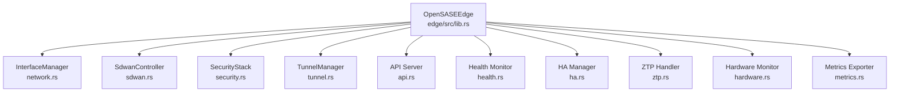
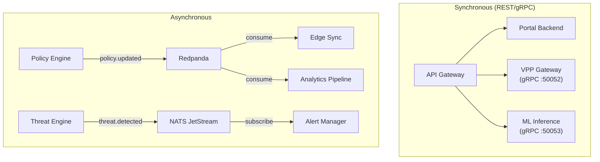

# Software Architecture -- SASE-SDWAN Platform
> Version: 1.0 | Last Updated: 2026-02-17 | Status: Draft
> Classification: Internal | Author: AIDD System

## 1. Design Philosophy

OpenSASE follows five core architectural principles:
1. **Performance by default**: Rust for all critical paths, zero-copy where possible
2. **Modularity**: 45+ Rust crates in a Cargo workspace, each with a single responsibility
3. **Event-driven**: Async message passing via Redpanda and NATS JetStream
4. **Defense in depth**: Multiple security layers, never trusting a single boundary
5. **Observable**: Structured tracing, metrics, and audit logs from every component

## 2. Rust Workspace Monorepo

The `opensase-core/` directory uses a Cargo workspace with 45+ crates (from `opensase-core/Cargo.toml`):

| Category | Crates |
|----------|--------|
| Security | sase-policy, sase-dlp, sase-casb, sase-ips, sase-ztna, sase-ddos, sase-fpe, sase-compliance |
| Networking | sase-dataplane, sase-xdp, sase-vpp, sase-path, sase-sdwan, sase-backbone, sase-peering |
| Platform | sase-gateway, sase-apigw, sase-orchestrator, sase-tenant, sase-billing, sase-resilience |
| ML/Analytics | sase-ml, sase-behavioral, sase-soc, sase-threat-intel |
| Infrastructure | sase-xds, sase-envoy-filters, sase-l7, sase-cloud-connector, sase-ite, sase-usie |
| Business Apps | sase-crm, sase-support, sase-ecommerce, sase-payments, sase-hr, sase-marketing, sase-forms, sase-scheduling |
| SDK | opensase-sdk (with domain modules: identity, crm, commerce, payments) |

Build profile from `opensase-core/Cargo.toml`:
```toml
[profile.release]
lto = "fat"
codegen-units = 1
panic = "abort"
strip = true
opt-level = 3
```

## 3. Design Patterns

### 3.1 Lock-Free Concurrent Data Structures

For sub-microsecond policy evaluation, the platform avoids mutexes on hot paths:

| Pattern | Library | Version | Usage |
|---------|---------|---------|-------|
| Concurrent HashMap | `dashmap` | 5.5 | Active session table, flow cache |
| Atomic Pointer Swap | `arc-swap` | 1.6 | Hot policy reload without locks |
| Lock-free Map | `flurry` | 0.5 | Read-heavy policy lookup |
| Eventual Consistent Map | `evmap` | 10.0 | Read-optimized counters and metrics |
| Async-aware Cache | `moka` | 0.12 | LRU cache with TTL for DNS, DLP patterns |
| Fine-grained Locks | `parking_lot` | 0.12 | Configuration updates (write-infrequent) |

### 3.2 Actor Model for Edge Appliance

The edge appliance (`edge/src/lib.rs`) uses Arc-wrapped components running as independent Tokio tasks:



Each component is wrapped in `Arc<>` for shared ownership. The main run loop uses `tokio::select!` for concurrent task management.

### 3.3 Middleware Chain Pattern (API)

The API gateway (`api/src/lib.rs`) uses Tower middleware composition:

```
Request -> Rate Limiter -> Auth Validator -> CORS -> Route Handler -> Response
           middleware/     middleware/       tower-http   routes/
           rate_limit.rs   auth.rs
```

### 3.4 Strategy Pattern for Policy Compilation (UPO)

The Unified Policy Orchestrator (`components/upo/`) uses adapter pattern:
- `compiler.py` receives intent policies (YAML)
- Each adapter (FlexiWAN, OpenZiti, Suricata, Unbound) implements `compile()`, `validate()`, `apply()`
- `models.py` defines `CompiledOutput`, `ApplyResult` with typed responses

### 3.5 Observer Pattern for QoE Path Selection

The QoE selector (`components/qoe-selector/`) pipeline:
1. `probes.py` -- sends ICMP/HTTP/TCP probes
2. `scorer.py` -- computes weighted path scores per `AppClassThresholds`
3. `recommender.py` -- generates `SteeringRecommendation` with confidence scores
4. `simulator.py` -- testing with scenarios (WAN failure, congestion, failover)

### 3.6 Event Sourcing for Audit Trail

All control plane mutations captured as immutable events via Redpanda topics, materialized in ClickHouse for analytics.

## 4. Microservices Architecture

### 4.1 Service Catalog

| Service | Source | Language | Port | Scaling |
|---------|--------|----------|------|---------|
| API Gateway | `api/src/` | Rust/Axum | 8080, 50051 | HPA 3-10 |
| Portal Backend | `portal/backend/src/` | Rust/Axum | 8080 | 2 replicas |
| Portal Frontend | `opensase-portal/` | React/Vite | 80 | 2 replicas |
| Portal Backend (Python) | `portal/backend/app/` | FastAPI | 8000 | 1 replica |
| Edge Agent | `edge/src/` | Rust/Tokio | 9443 | 1 per site |
| ML Inference | `ml/inference/` | Rust/ONNX | 50053 | 1 per PoP |
| VPP Gateway | `opensase-core/crates/vpp-gateway/` | Rust/Tonic | 50052 | DaemonSet |
| UPO | `components/upo/` | Python | 8001 | 1 per region |
| QoE Selector | `components/qoe-selector/` | Python | 8002 | 1 per region |
| CASB-Lite | `components/casb-lite/` | Python | 8003 | 1 per region |
| DLP-Lite | `components/dlp-lite/` | Python | 8004 | 1 per region |

### 4.2 Inter-Service Communication



## 5. Data Architecture

### 5.1 Data Store Selection

| Data Type | Store | Rationale |
|-----------|-------|-----------|
| Tenants, Users, Policies, Sites | YugabyteDB | ACID transactions, distributed SQL |
| Sessions, Flows, Events | ScyllaDB | High write throughput |
| Policy Cache, Session State | DragonflyDB | Sub-ms reads, Redis-compatible |
| Event Streams | Redpanda | Kafka API, lower latency |
| Control Messages | NATS JetStream | Lightweight pub/sub |
| Logs | Quickwit | Full-text search |
| Analytics | ClickHouse | Time-series OLAP |
| SIEM | Wazuh/OpenSearch | Security correlation |
| FlexiWAN Config | MongoDB 6 | FlexiWAN native |
| Keycloak State | PostgreSQL 15 | Keycloak native |

### 5.2 Three-Tier Caching

1. **L1 (In-Process)**: Moka LRU in Rust (< 1us)
2. **L2 (Distributed)**: DragonflyDB (< 1ms)
3. **L3 (Database)**: YugabyteDB follower reads (< 5ms)

Cache invalidation via NATS pub/sub: `cache.invalidate.{resource}.{id}`

## 6. Error Handling

### 6.1 Domain Error Types

Each crate uses `thiserror` for typed errors:
```rust
// edge/src/lib.rs
#[derive(Debug, Error)]
pub enum EdgeError {
    #[error("network error: {0}")] Network(String),
    #[error("tunnel error: {0}")] Tunnel(String),
    #[error("config error: {0}")] Config(String),
    #[error("security error: {0}")] Security(String),
}
```

### 6.2 API Error Response

Standardized via `api/src/models.rs` `ApiResponse<T>` and `ErrorResponse`:
```json
{"success": false, "data": null, "error": {"code": "NOT_FOUND", "message": "..."}}
```

## 7. Testing Strategy

| Level | Framework | Location |
|-------|-----------|----------|
| Unit | `cargo test`, `pytest` | Each crate/module |
| Integration | `axum-test` | `api/` |
| Property | `proptest` | `opensase-core/` |
| Benchmarks | `criterion` | `opensase-core/benches/` |
| Smoke | Shell scripts | `scripts/smoke-test.sh` |
| Load | TRex | `opensase-core/vpp/tests/` |

Benchmark targets from `opensase-core/README.md`:
```
policy_lookup/cached  time: [45.2 ns  46.1 ns  47.0 ns]
policy_lookup/miss    time: [421 ns   432 ns   445 ns]
dlp_scan/1kb         time: [42.3 us  44.1 us  46.2 us]
```

## 8. SDK Architecture

SDKs in `sdk/` and `opensase-core/sdks/`:

| Language | Location | Paradigm |
|----------|----------|----------|
| Rust | `opensase-core/sdks/rust/lib.rs` | Native async |
| Python | `opensase-core/sdks/python/__init__.py` | Async httpx |
| Go | `opensase-core/sdks/go/opensase.go` | Context-aware |
| TypeScript | `opensase-core/sdks/typescript/index.ts` | Promise-based |

The `opensase-sdk` crate provides domain models for Identity, CRM, Commerce, and Payments.

## 9. Configuration Management

All services follow 12-factor app principles. Template: `.env.example` with sections for FlexiWAN, Keycloak, Wazuh, OpenZiti, Portal, Grafana, and Network configuration.

Key config files: Suricata (`docker/security-pop/suricata/suricata.yaml`), Envoy (`opensase-core/envoy/config/envoy.yaml`), Prometheus (`docker/prometheus/prometheus.yml`), Keycloak realm (`docker/keycloak/realm-export.json`).

## 10. Key Dependencies

From `opensase-core/Cargo.toml` workspace:
- **Async**: tokio 1.35, async-trait 0.1
- **Concurrency**: dashmap 5.5, arc-swap 1.6, crossbeam 0.8
- **Serialization**: serde 1.0, simd-json 0.13, rkyv 0.7
- **Pattern Matching**: aho-corasick 1.1, regex 1.10
- **eBPF**: aya 0.12, libbpf-rs 0.22
- **ML**: ort 2.0, candle-core 0.3
- **HTTP/gRPC**: axum 0.7, tonic 0.11, hyper 1.1
- **Crypto**: sha2 0.10, x25519-dalek 2
- **Observability**: tracing 0.1, metrics 0.22

Frontend (`opensase-portal/package.json`): React 18, React Router DOM 6, TanStack Query 5, Recharts 2, Vite 5, TypeScript 5.3.
