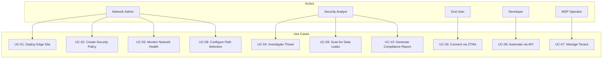

# Use Cases -- SASE-SDWAN Platform
> Version: 1.0 | Last Updated: 2026-02-17 | Status: Draft
> Classification: Internal | Author: AIDD System

## 1. Actors

| Actor | Description | Primary Interface |
|-------|-------------|-------------------|
| Network Admin | Manages SD-WAN topology, tunnels, routing | Portal (Sites, Tunnels pages), CLI |
| Security Analyst | Monitors threats, investigates incidents | Portal (Security page), Wazuh Dashboard |
| IT Director | Reviews compliance dashboards, approves policies | Portal (Dashboard), Reports |
| End User | Connects to corporate resources remotely | Desktop/Mobile Client |
| Developer | Builds integrations using OpenSASE APIs | API Gateway, SDKs, CLI |
| MSP Operator | Manages multiple customer tenants | Portal (multi-tenant admin) |
| Edge Device | Autonomous appliance at branch offices | ZTP, Controller API |

## 2. Use Case Diagram

## 3. Detailed Use Cases

### UC-01: Deploy Edge Site

| Field | Value |
|-------|-------|
| Actor | Network Admin |
| Precondition | Admin has portal access, edge hardware available |
| Trigger | New branch office needs connectivity |
| Main Flow | 1. Admin creates site in portal (`POST /api/v1/tenants/:id/sites`) 2. System generates bootstrap token 3. Admin powers on edge with USB containing token 4. Edge runs ZTP (`edge/src/ztp.rs`), registers with controller 5. Edge establishes WireGuard tunnels to nearest PoPs 6. Edge applies security policies 7. Site status changes to Active |
| Postcondition | Branch office connected and secured |
| Alternative | Manual configuration via CLI if ZTP fails |
| Source Files | `edge/src/ztp.rs`, `edge/src/tunnel.rs`, `api/src/routes/sites.rs` |

### UC-02: Create Security Policy

| Field | Value |
|-------|-------|
| Actor | Network Admin, Security Analyst |
| Precondition | Authenticated with Admin or Editor role |
| Trigger | New compliance requirement or security incident |
| Main Flow | 1. Admin navigates to Policies page (`opensase-portal/src/pages/Policies.tsx`) 2. Creates intent policy (name, conditions, action) 3. API validates (`api/src/models.rs: PolicyCreate`) 4. UPO compiles to vendor configs (`components/upo/upo/compiler.py`) 5. Policy distributed via NATS to edges 6. Edges apply policy rules locally |
| Postcondition | Policy active across all affected sites |
| Source Files | `api/src/routes/policies.rs`, `components/upo/`, `opensase-portal/src/pages/Policies.tsx` |

### UC-03: Connect via ZTNA

| Field | Value |
|-------|-------|
| Actor | End User |
| Precondition | Client installed, identity enrolled in OpenZiti |
| Trigger | User needs to access private application |
| Main Flow | 1. User opens desktop client (`client/core/`) 2. Client authenticates via Keycloak OIDC 3. Client performs posture check (`client/core/src/posture.rs`) 4. Ziti controller evaluates identity + policy 5. mTLS session established to Ziti router 6. User accesses private app (no public IP needed) |
| Postcondition | Secure session to private application |
| Alternative | Clientless browser access via RBI for web apps |
| Source Files | `client/core/src/tunnel.rs`, `client/core/src/posture.rs`, `client/core/src/policy.rs` |

### UC-04: Investigate Security Threat

| Field | Value |
|-------|-------|
| Actor | Security Analyst |
| Precondition | Alert generated by ML engine or Suricata |
| Trigger | Critical or high severity alert appears |
| Main Flow | 1. Alert appears on Security page (`opensase-portal/src/pages/Security.tsx`) 2. Analyst reviews alert details (source IP, MITRE technique, confidence) 3. Analyst queries flow logs in Quickwit 4. Analyst checks user behavior in Wazuh dashboard (:5601) 5. Analyst creates block rule or acknowledges false positive 6. Feedback sent to ML engine (`ml/inference/src/feedback.rs`) |
| Postcondition | Threat mitigated or false positive recorded |
| Source Files | `ml/inference/src/alerts.rs`, `ml/inference/src/hunting.rs`, `opensase-portal/src/pages/Security.tsx` |

### UC-05: Monitor Network Health

| Field | Value |
|-------|-------|
| Actor | Network Admin |
| Precondition | Services running |
| Trigger | Routine monitoring or alert |
| Main Flow | 1. Admin views Dashboard (`opensase-portal/src/pages/Dashboard.tsx`) 2. Reviews: Active Sites (12), Active Tunnels (24), Throughput (87.2 Gbps) 3. Checks traffic chart (Recharts AreaChart) 4. Reviews recent alerts list 5. Drills into specific site or tunnel for details 6. Checks Grafana dashboards (:3001) for detailed metrics |
| Source Files | `opensase-portal/src/pages/Dashboard.tsx`, `docker/grafana/dashboards/overview.json` |

### UC-06: Automate via API

| Field | Value |
|-------|-------|
| Actor | Developer |
| Precondition | API key created with appropriate scopes |
| Trigger | CI/CD pipeline or custom automation |
| Main Flow | 1. Developer reviews OpenAPI docs at `/docs` (Swagger UI) 2. Creates API key (`POST /api/v1/api-keys`) 3. Uses SDK to interact with platform 4. Subscribes to webhooks for events 5. Automates site provisioning, policy updates, alert handling |
| Source Files | `api/src/lib.rs`, `api/src/routes/api_keys.rs`, `api/src/routes/webhooks.rs`, `sdk/` |

### UC-07: Manage Multi-Tenant Environment

| Field | Value |
|-------|-------|
| Actor | MSP Operator |
| Main Flow | 1. Create new tenant with plan and limits 2. Configure identity federation for tenant 3. Deploy PoP resources for tenant 4. Monitor per-tenant resource usage 5. Generate billing reports |
| Source Files | `opensase-core/crates/sase-tenant/`, `opensase-core/crates/sase-billing/` |

### UC-08: Configure QoE Path Selection

| Field | Value |
|-------|-------|
| Actor | Network Admin |
| Main Flow | 1. Define application classes (voice, video, web, bulk) 2. Set SLA thresholds per class 3. QoE selector probes WAN links continuously 4. System steers traffic to optimal path per class 5. Admin monitors path quality on dashboard |
| Source Files | `components/qoe-selector/qoe_selector/models.py`, `components/qoe-selector/qoe_selector/scorer.py` |

### UC-09: DLP Content Scan

| Field | Value |
|-------|-------|
| Actor | Security Analyst, Automated System |
| Main Flow | 1. User uploads file to cloud service 2. SWG intercepts upload 3. DLP scanner (`dlp_lite/scanner.py`) runs classifiers 4. If sensitive data found (SSN, credit card, API key): block 5. Alert created with match details and severity |
| Source Files | `components/dlp-lite/dlp_lite/scanner.py`, `opensase-core/crates/sase-dlp/` |

### UC-10: CASB SaaS Monitoring

| Field | Value |
|-------|-------|
| Actor | Security Analyst |
| Main Flow | 1. CASB connector syncs with Google Workspace and Microsoft 365 2. Events normalized to common schema (`NormalizedEvent`) 3. Risky sign-ins detected (location anomaly, impossible travel) 4. Shadow IT discovered (unauthorized SaaS apps) 5. OAuth token permissions audited |
| Source Files | `components/casb-lite/casb_lite/models.py` |

## 4. Use Case Traceability Matrix

| Use Case | PRD Requirement | API Endpoint | Portal Page | Test |
|----------|----------------|--------------|-------------|------|
| UC-01 | PR-104 (ZTP) | POST /sites | Sites | T1 (smoke test) |
| UC-02 | PR-801 | POST /policies | Policies | T9 |
| UC-03 | PR-201, PR-202 | N/A (Ziti) | N/A | T2, T3 |
| UC-04 | PR-702 | GET /alerts | Security | T7 |
| UC-05 | PR-802 | GET /analytics | Dashboard | T9 |
| UC-06 | PR-901 | All endpoints | /docs | T8, T9 |
| UC-07 | BR-09, BR-10 | POST /tenants | Admin | N/A |
| UC-08 | PR-102 | GET /tunnels/stats | Tunnels | T1 |
| UC-09 | PR-501 | POST /scan | Policies | N/A |
| UC-10 | PR-401 | GET /casb/events | Security | N/A |
