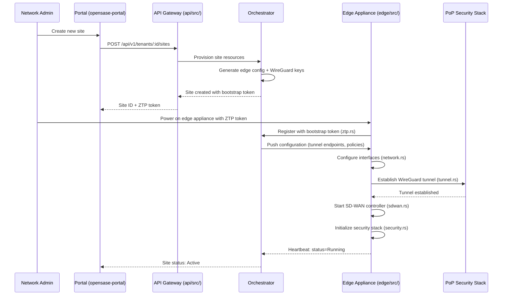
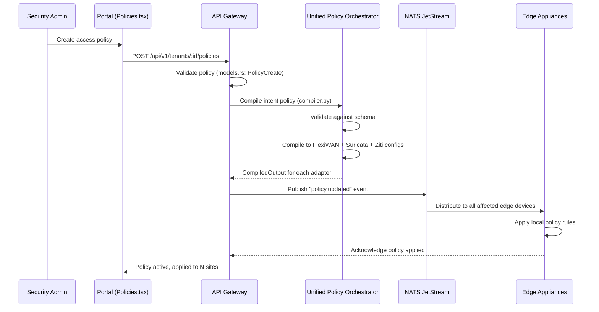
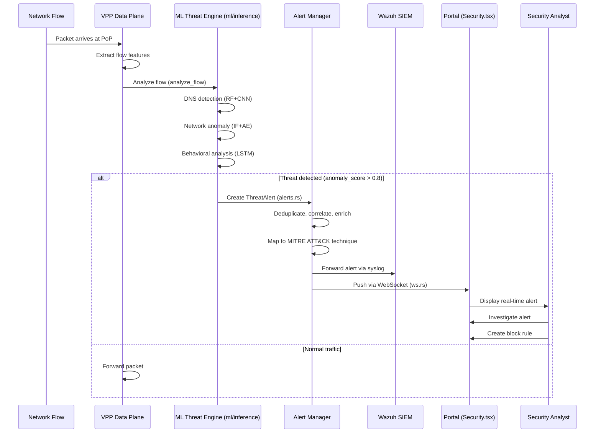
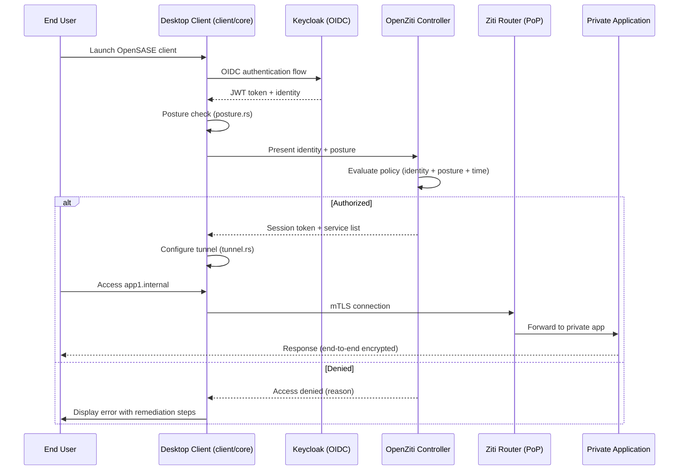
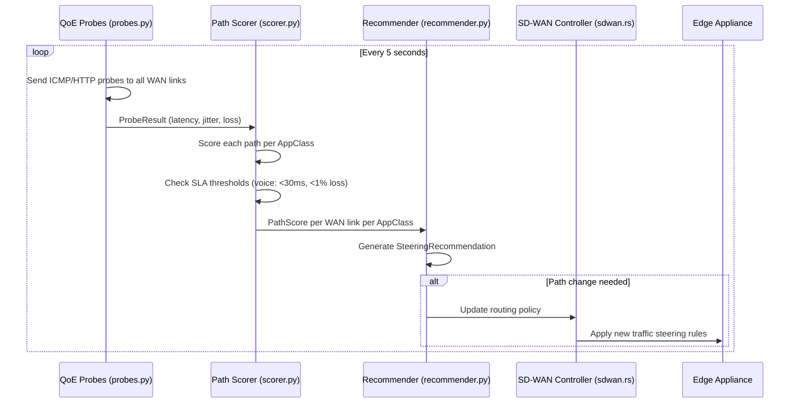
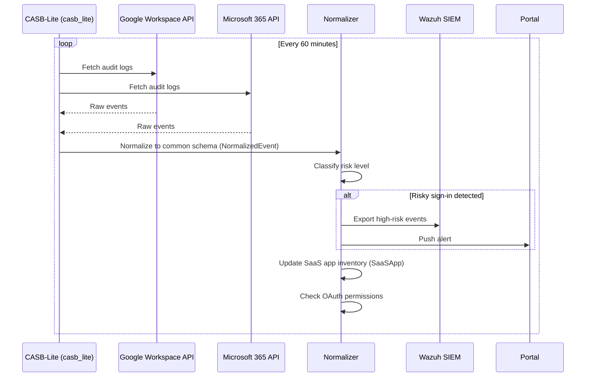
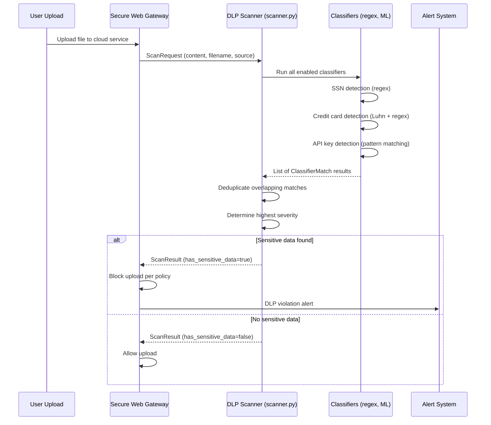
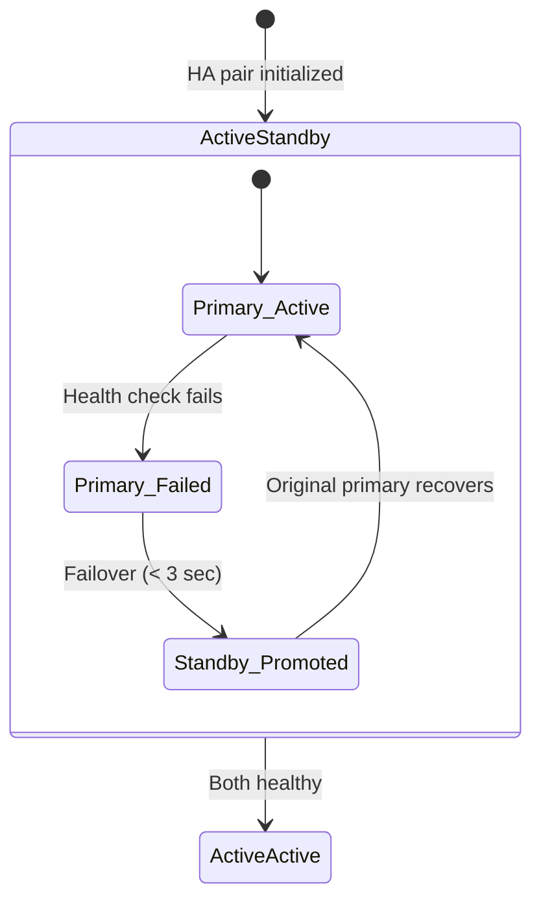
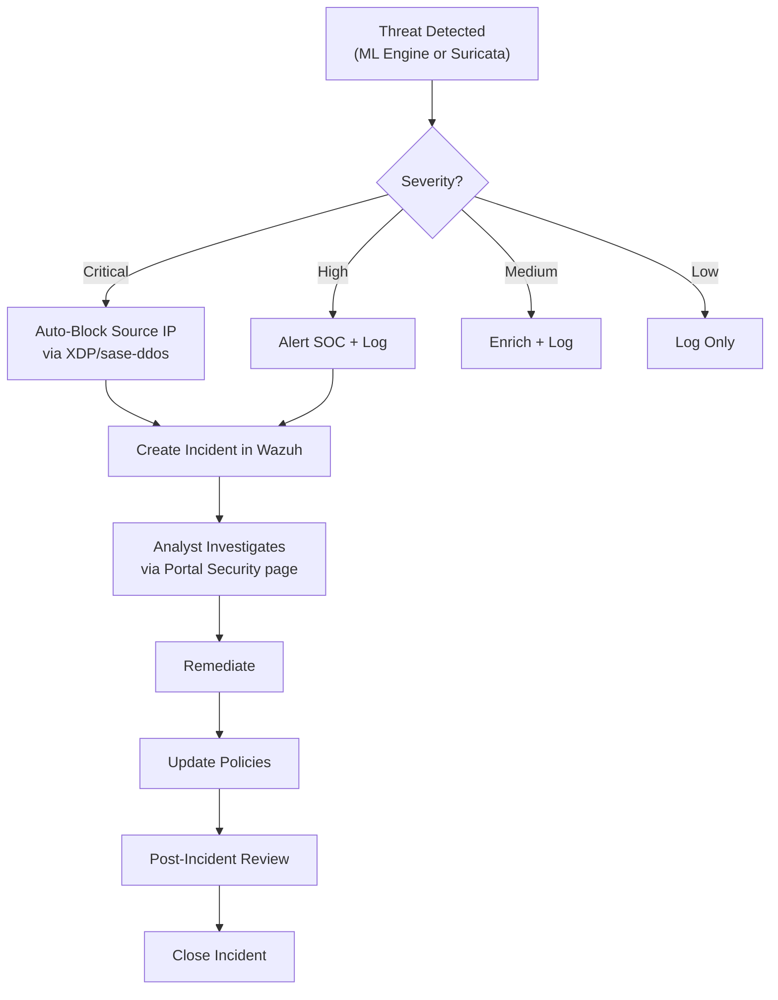

# Workflows -- SASE-SDWAN Platform
> Version: 1.0 | Last Updated: 2026-02-17 | Status: Draft
> Classification: Internal | Author: AIDD System

## 1. Site Onboarding Workflow

## 2. Policy Management Workflow

## 3. Threat Detection and Response Workflow

## 4. VPN Client Connection Workflow

## 5. QoE Path Selection Workflow

## 6. CASB SaaS Monitoring Workflow

## 7. DLP Content Scanning Workflow

## 8. Edge High Availability Failover Workflow

## 9. Smoke Test Workflow

From `scripts/smoke-test.sh`, automated validation runs these tests:

| Test | Description | Pass Criteria |
|------|-------------|---------------|
| T1 | SD-WAN overlay ping | Branch A/B/C ping each other via overlay |
| T2 | ZTNA access to App1 | Access nginx via Ziti (no public port) |
| T3 | ZTNA access to App2 | Access httpbin via Ziti (no public port) |
| T4 | Suricata IPS mode | IPS running in inline mode |
| T5 | IPS logging | eve.json receiving events |
| T6 | Wazuh agent registration | All agents connected to manager |
| T7 | Wazuh alert generation | Synthetic alerts indexed |
| T8 | Keycloak health | OIDC endpoints responding |
| T9 | Portal API health | /api/health returns healthy |

## 10. Incident Response Workflow

